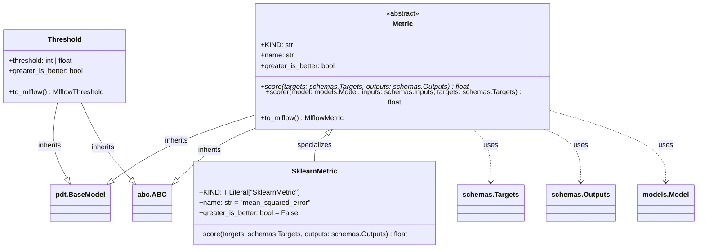

# US [Metrics](./backlog_mlops_regresion.md) : Provide standardized measurements for model performance, accuracy, and evaluation

Provide standardized measurements for model performance, accuracy, and evaluation. Useful for tracking improvement and identifying bottlenecks.

- [US Metrics : Provide standardized measurements for model performance, accuracy, and evaluation](#us-metrics--provide-standardized-measurements-for-model-performance-accuracy-and-evaluation)
  - [classes relations](#classes-relations)
  - [**User Story: Develop a Base Metric Class for Model Evaluation**](#user-story-develop-a-base-metric-class-for-model-evaluation)
  - [**User Story: Implement a Scikit-learn Metric Wrapper**](#user-story-implement-a-scikit-learn-metric-wrapper)
  - [**User Story: Implement a Threshold Class for Metric Monitoring**](#user-story-implement-a-threshold-class-for-metric-monitoring)
  - [Code location](#code-location)
  - [Test location](#test-location)

------------

## classes relations

## **User Story: Develop a Base Metric Class for Model Evaluation**

---

**Title:**  
As a **machine learning engineer**, I want a **base `Metric` class** to standardize the evaluation of model performance, so that I can consistently compute and report metrics across different models and use cases.

---

**Description:**  
The `Metric` class serves as a base for implementing various evaluation metrics. It defines the core attributes and methods required for metric computation, ensures compatibility with `mlflow`, and facilitates seamless integration into machine learning pipelines using `pydantic` for validation.

---

**Acceptance Criteria:**  

1. **Attributes**  
   - Define `KIND` to identify the metric type.  
   - Include `name` (str) and `greater_is_better` (bool).

2. **Abstract Method: `score`**  
   - Define `score` to compute the metric value from `targets` and `outputs`.

3. **Helper Method: `scorer`**  
   - Implement `scorer` to evaluate a model's predictions against targets using the metric.

4. **Integration with `mlflow`: `to_mlflow`**  
   - Provide `to_mlflow` to convert the metric into an `mlflow.metrics.make_metric` object.

5. **Validation**  
   - Use `pydantic.BaseModel` with `strict=True`, `frozen=True`, and `extra="forbid"`.

---

**Definition of Done (DoD):**  

- `Metric` class implemented and tested.
- `to_mlflow` integration verified.
- Unit tests cover various metric scenarios.

## **User Story: Implement a Scikit-learn Metric Wrapper**

---

**Title:**  
As a **data scientist**, I want to use `SklearnMetric` to compute evaluation metrics using scikit-learn functions.

---

**Description:**  
The `SklearnMetric` class extends `Metric` to utilize `sklearn.metrics`. It allows computing metrics based on the `name` attribute using `getattr(metrics, self.name)`.

---

**Acceptance Criteria:**  

1. **Attributes**  
   - `KIND` set to `"SklearnMetric"`.
   - `name` defaults to `"mean_squared_error"`.
   - `greater_is_better` defaults to `False`.

2. **`score` Method**  
   - Computes the metric value using `sklearn.metrics`.
   - Adjusts the sign based on `greater_is_better`.

---

**Definition of Done (DoD):**  

- `SklearnMetric` implemented and tested with standard sklearn metrics.

## **User Story: Implement a Threshold Class for Metric Monitoring**

---

**Title:**  
As a **machine learning engineer**, I want to define a `Threshold` class for metrics to monitor performance and trigger alerts.

---

**Description:**  
The `Threshold` class provides a way to define and manage thresholds, supporting integration with `mlflow` thresholds.

---

**Acceptance Criteria:**  

1. **Attributes**  
   - `threshold` (int | float).
   - `greater_is_better` (bool).

2. **Method: `to_mlflow`**  
   - Converts to `mlflow.models.MetricThreshold`.

---

**Definition of Done (DoD):**  

- `Threshold` class implemented and `to_mlflow` verified.

## Code location

[src/regression_model_template/core/metrics.py](../src/regression_model_template/core/metrics.py)

## Test location

[tests/core/test_metrics.py](../tests/core/test_metrics.py)