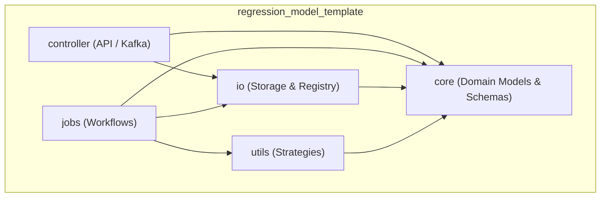
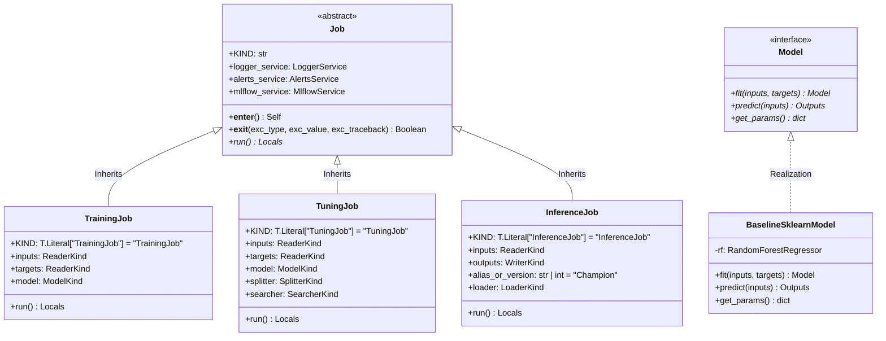

# Component Structure View: mlops-python-package

This viewpoint describes the internal modular architecture of the codebase, outlining package layers, dependencies, and core abstraction implementations.

## 1. Package Dependency Diagram

## 2. Component Overviews

### 🎮 Controller Package
- **Responsibility:** Exposes REST API endpoint `/predict` and consumes/produces Confluent Kafka streams.
- **Key Modules:**
  - `kafka_app.py` — Wraps FastAPI server and `confluent_kafka` loops. Includes sliding window rate limiter.

### 🧠 Core Package
- **Responsibility:** Contains domain abstractions and data schemas.
- **Key Modules:**
  - `models.py` — Models wrapper adapters (Forest models, linear models, MLflow registered models).
  - `metrics.py` — Model performance measurement structures.
  - `schemas.py` — Pandera-based dataframe structures validation.

### 📥 IO Package
- **Responsibility:** Reads/writes Parquet files, loads YAML configurations, handles environment variables, and interfaces with MLflow.
- **Key Modules:**
  - `datasets.py` — Reader and Writer components.
  - `registries.py` — Model loaders and model metadata retrievers.
  - `services.py` — Lifecycle handlers for logging, alerts, and MLflow setups.

### ⚙️ Jobs Package
- **Responsibility:** Orchestrated workflow tasks executed in a resource lifecycle context manager.
- **Key Modules:**
  - `base.py` — Abstract Base Class `Job` defining the service setup context (`__enter__`/`__exit__`).
  - `training.py`, `tuning.py`, `evaluations.py`, `explanations.py`, `inference.py`, `promotion.py`.

### 🛠️ Utilities Package
- **Responsibility:** Computational strategy wrappers.
- **Key Modules:**
  - `searchers.py` — Extensible hyperparameter tuning searchers.
  - `splitters.py` — Fold splitter wrappers (e.g. TimeSeriesSplit).
  - `signers.py` — Signature generator for dataset compatibility validation.

## 3. Core Class Hierarchy (UML 2.0 Class Diagram)

