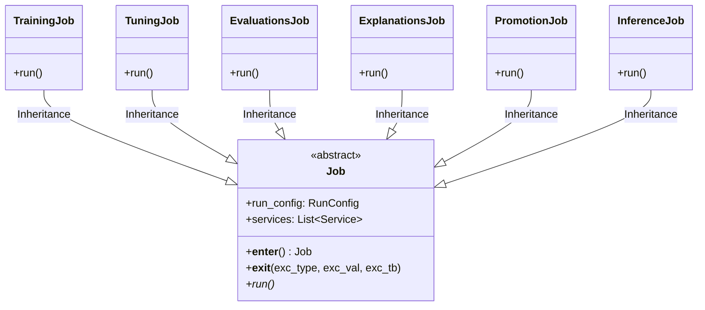
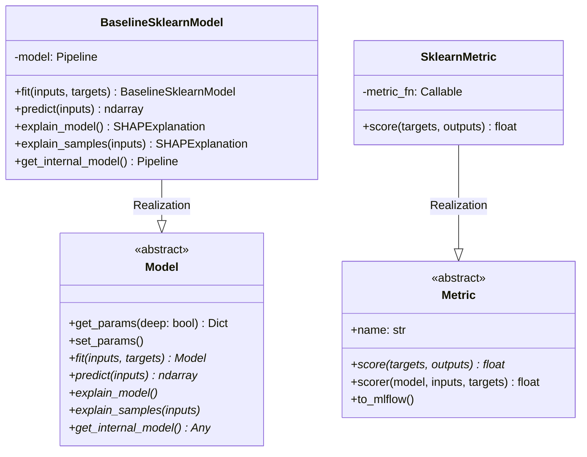
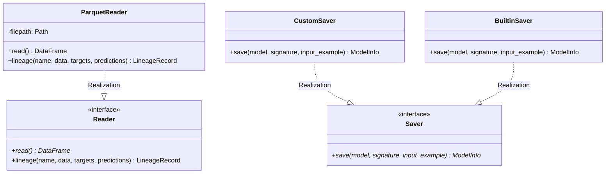

# ISO 42010 Component View: Subsystem Breakdown & UML 2.0 Class Diagrams

## 1. Subsystem Architecture Overview

`mlops-python-package` is organized into 5 primary subsystems:

1. **Controller Subsystem (`controller/`)**: Real-time Kafka consumer/producer and embedded FastAPI web application (`FastAPIKafkaService`).
2. **Pipeline Jobs Subsystem (`jobs/`)**: Job runner abstraction (`Job`) and concrete workflow implementations (`TrainingJob`, `TuningJob`, `EvaluationsJob`, `ExplanationsJob`, `PromotionJob`, `InferenceJob`).
3. **Core Model & Schema Subsystem (`core/`)**: Model wrapper interfaces (`Model`, `BaselineSklearnModel`), Pandera schemas (`InputsSchema`, `TargetsSchema`, `OutputsSchema`), and evaluation metrics (`Metric`, `SklearnMetric`).
4. **I/O & Service Layer (`io/`)**: Data reader/writer abstractions (`Reader`, `ParquetReader`), MLflow registry savers/loaders (`Saver`, `Loader`, `MlflowRegister`), and telemetry services (`LoggerService`, `MlflowService`, `AlertsService`).
5. **Utility Layer (`utils/`)**: Search strategy algorithms (`GridCVSearcher`), signature extraction (`InferSigner`), and dataset splitters (`TrainTestSplitter`, `TimeSeriesSplitter`).

---

## 2. UML 2.0 Class Hierarchy Diagrams

### A. Pipeline Job Abstraction Hierarchy

### B. Core Model & Evaluation Metrics Hierarchy

### C. I/O Data Readers, Writers & Registries

