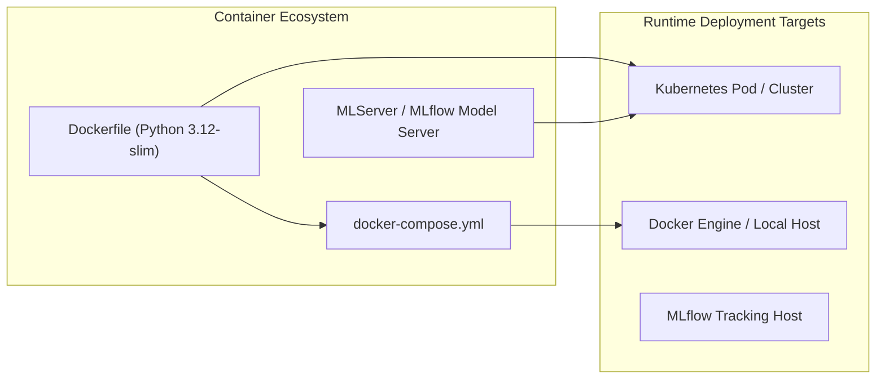

# ISO 42010 Deployment View: Runtime Infrastructure & Containerization

## 1. Deployment Overview & Container Strategy

`mlops-python-package` supports containerized deployment for both batch pipeline training and real-time Kafka/FastAPI streaming endpoints.

---

## 2. Docker Configuration (`Dockerfile` & `docker-compose.yml`)

### A. Base Image & Build Layers
* **Base Image:** `python:3.12-slim`
* **Dependency Manager:** `poetry`
* **Build Stages:** Multi-stage build isolating build tools (`gcc`, `curl`) from final minimal runtime image.
* **Environment Variables:** `PYTHONPATH=/app/src`, `POETRY_VIRTUALENVS_CREATE=false`.

### B. Service Topology (`docker-compose.yml`)
* **Kafka Service:** Listens on port `9092` for real-time inference streaming.
* **FastAPI Service:** Exposes `/health`, `/metrics`, and `/predict` on port `8000`.
* **MLflow Tracking Server:** Connected via `MLFLOW_TRACKING_URI`.

---

## 3. Environment Configuration (`src/regression_model_template/io/osvariables.py:L16-L26`)

The service automatically ingests runtime settings from `.env` files or system environment variables:

| Variable | Default Value | Description |
| :--- | :--- | :--- |
| `ENV` | `dev` | Environment scope (`dev`, `staging`, `prod`). |
| `MLFLOW_TRACKING_URI` | `http://localhost:5000` | Target MLflow tracking server URI. |
| `KAFKA_BOOTSTRAP_SERVERS` | `localhost:9092` | Kafka broker endpoints. |
| `KAFKA_INPUT_TOPIC` | `regression-inputs` | Kafka topic for raw inference payloads. |
| `KAFKA_OUTPUT_TOPIC` | `regression-outputs` | Kafka topic for prediction results. |
| `OTEL_EXPORTER_OTLP_ENDPOINT` | `http://localhost:4317` | OpenTelemetry OTLP gRPC endpoint. |
