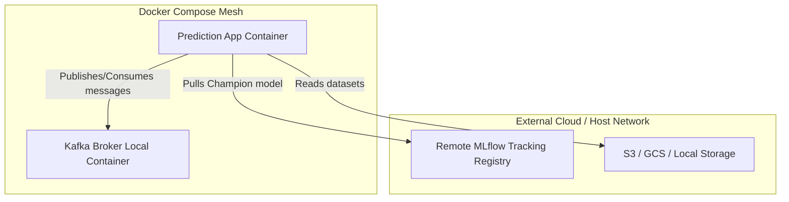

# Deployment View: mlops-python-package

This viewpoint describes the target deployment environments, containerization boundaries, and dependency management structures.

## 1. Infrastructure Deployment Topology

The service is packaged as a Docker container, running a FastAPI web application and confluent-kafka consumer threads, communicating with external MLflow and Kafka brokers.

## 2. Dependency Management & Runtime Environment

- **Python Version:** Pinned to `3.12` in `.python-version` and `pyproject.toml`.
- **Package Manager:** Poetry. Dependencies are locked in `poetry.lock`.
- **Key System Packages:**
  - `fastapi` & `uvicorn` (HTTP Application serving).
  - `confluent-kafka` (High-performance C-wrapper Client for Kafka).
  - `mlflow` (Experiment tracking and model loader).
  - `pandera` & `pydantic` (Runtime validations).

## 3. Containerization Specifications

### Dockerfile (`/Dockerfile`)
The service uses a multi-stage Docker build to build confluent-kafka and run the FastAPI app securely:
- **Base:** `python:3.12-slim`
- **Builder:** Installs build essentials and dependencies.
- **Runtime:** Copies environment and runs the main service entrypoint:
  `python -m regression_model_template.controller.kafka_app`

### Compose Config (`/docker-compose.yml`)
Binds port `8100` and configures environment variables:
- `DEFAULT_KAFKA_SERVER`: Address of target broker.
- `DEFAULT_INPUT_TOPIC`: Kafka input topic name.
- `DEFAULT_OUTPUT_TOPIC`: Kafka output topic name.
