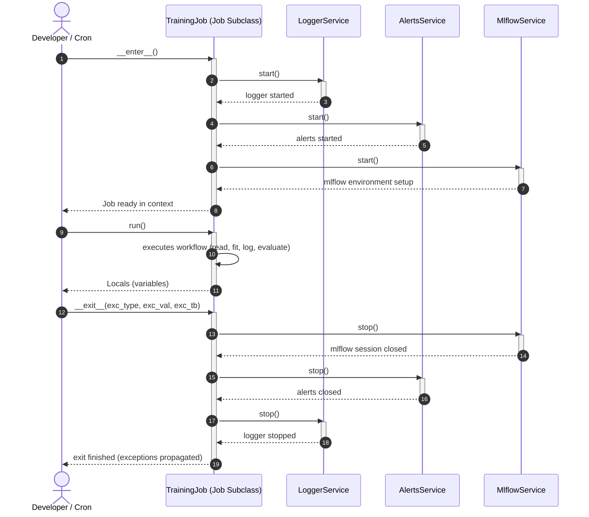
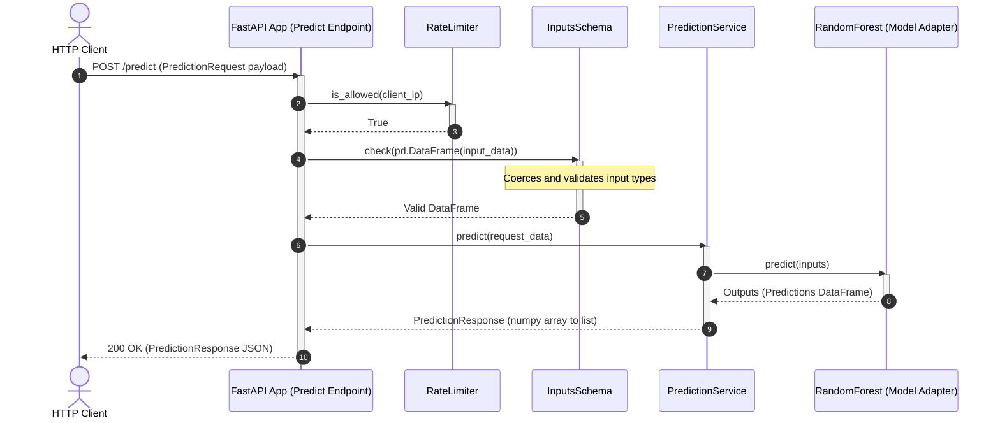

# Runtime Sequence View: mlops-python-package

This viewpoint describes the runtime interaction patterns within the system, focusing on the Job context manager lifecycle and prediction requests.

## 1. Job Lifecycle Context Manager Sequence

This diagram shows how jobs safely initialize and finalize their dependencies (Logger, Alerts, MLflow) using Python's context manager (`__enter__` and `__exit__`).

## 2. Prediction API Request Handling Sequence

This diagram outlines how the FastAPI prediction service processes incoming real-time HTTP requests, validating them via schemas and the rate limiter before invoking the ML model.

