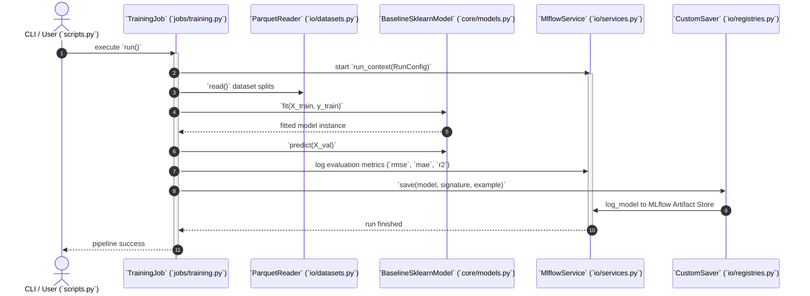
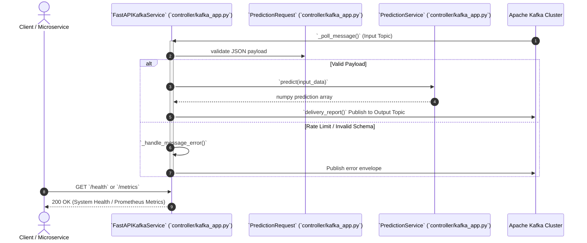

# ISO 42010 Sequence View: Runtime Workflows & Execution Sequences

## 1. Model Training & Registration Pipeline (`TrainingJob`)

---

## 2. Kafka Real-Time Streaming & FastAPI Inference (`FastAPIKafkaService`)

