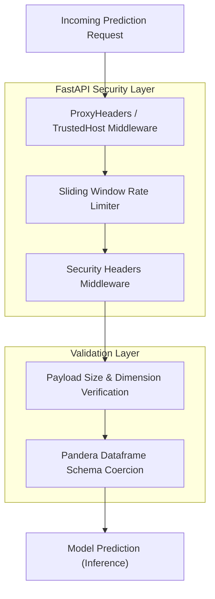

# Security View: mlops-python-package

This viewpoint describes the security controls, validation boundaries, and protection mechanisms built into the prediction serving engine.

## 1. Security Architecture Diagram

## 2. Security Mechanisms & Implementation

### 1. Sliding Window Rate Limiter
- **Implementation:** `RateLimiter` class in `src/regression_model_template/controller/kafka_app.py:L82-L113`.
- **Logic:** Tracks client IP in an `OrderedDict` of deques holding timestamps.
- **Limits:** Capped at `100` requests per `60` seconds window.
- **Memory Protection:** Maximum tracked IPs limit of `10000`. Once reached, the oldest tracked IP is evicted (Least Recently Used replacement) to prevent memory exhaustion.

### 2. HTTP Security Headers Middleware
- **Implementation:** `add_security_headers` middleware in `src/regression_model_template/controller/kafka_app.py:L68-L80`.
- **Headers Appended:**
  - `X-Content-Type-Options: nosniff` (Prevents MIME sniffing).
  - `X-Frame-Options: DENY` (Mitigates clickjacking).
  - `Strict-Transport-Security` (Enforces HTTPS access).
  - `Content-Security-Policy` (Restricts script and style source loading).
  - `Cache-Control` (Disables caching of prediction outputs containing sensitive data).

### 3. Payload Dimension Safeguards
- **Implementation:** `PredictionRequest.check_input_size` validator in `src/regression_model_template/controller/kafka_app.py:L147-L174`.
- **Caps:**
  - Max Columns: `100` (`MAX_INPUT_COLS`).
  - Max Rows: `10000` (`MAX_INPUT_ROWS`).
  - Column length uniformity check (ensures the payload is a valid rectangular shape).

### 4. Input Sanitization & Coercion
- **Implementation:** `InputsSchema.check` validator in `src/regression_model_template/core/schemas.py`.
- **Mechanics:** Coerces types and validates structure before invoking model prediction. Out-of-bounds inputs or malformed types are safely rejected, preventing engine failures.
