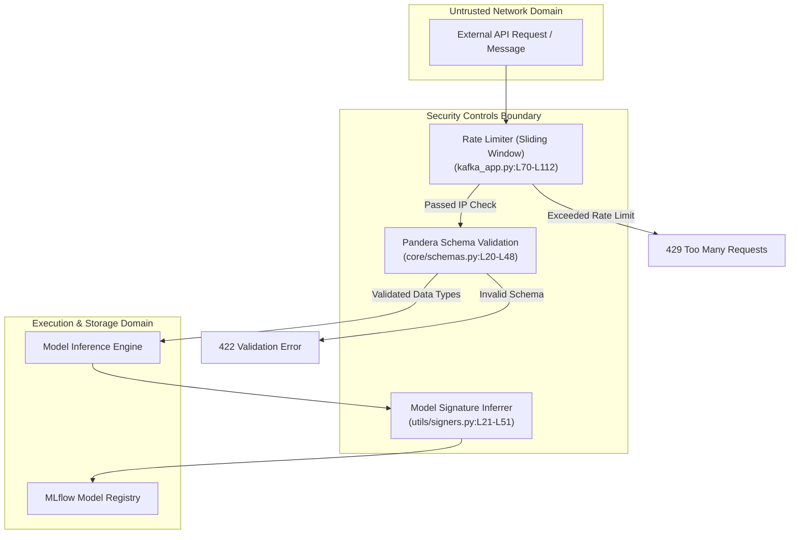

# ISO 42010 Security View: Cryptography, Authentication & Boundaries

## 1. Security Architecture & Threat Mitigation Boundaries

---

## 2. Security Mechanisms & Implementation

### A. IP Rate Limiting (`src/regression_model_template/controller/kafka_app.py:L70-L112`)
* **Mechanism:** In-memory `RateLimiter` class enforcing sliding window token bucket rate limits per client IP address.
* **Default Limits:** Maximum 100 requests per minute per IP to prevent Denial of Service (DoS) attacks on real-time prediction endpoints.

### B. Input Sanitization & Schema Validation (`src/regression_model_template/core/schemas.py:L20-L117`)
* **Mechanism:** Strict type enforcement using Pandera DataFrames and Pydantic `BaseModel` classes (`InputsSchema`, `PredictionRequest`).
* **Protection:** Prevents SQL/NoSQL injection, invalid payload deserialization, and unexpected null pointer exceptions during ML matrix operations.

### C. Model Artifact Integrity & Signing (`src/regression_model_template/utils/signers.py:L21-L51`)
* **Mechanism:** Automatic model signature inference (`InferSigner`) recording exact input feature names, data types, and output tensor shapes.
* **Protection:** Ensures models registered in MLflow cannot be tampered with or executed with incompatible input payloads.

### D. Environment Secret Isolation (`src/regression_model_template/io/osvariables.py:L16-L26`)
* **Mechanism:** Centralized `Env` configuration relying on Pydantic `BaseSettings`. Secrets (MLflow tokens, Kafka passwords) are ingested directly from system environment variables or sealed Kubernetes secrets. No hardcoded credentials exist in source code.
