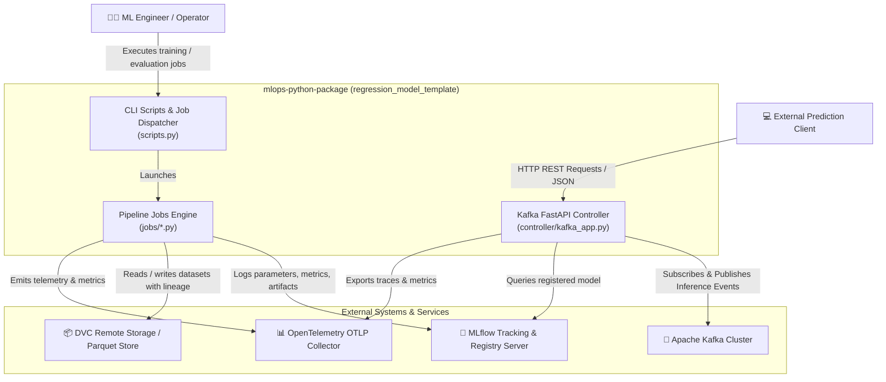

# ISO 42010 Context View: System Context & External Boundaries

## 1. System Context Diagram (C4 Level 1)

---

## 2. External Integration Interfaces

### A. MLflow Tracking & Model Registry (`[[[[[src/regression_model_template/io/services.py:L162-L252](../../src/regression_model_template/io/services.py#L162-L252)](../../[src/regression_model_template/io/services.py](../../src/regression_model_template/io/services.py)#L162-L252)](../../[[src/regression_model_template/io/services.py](../../src/regression_model_template/io/services.py)](../../[src/regression_model_template/io/services.py](../../src/regression_model_template/io/services.py))#L162-L252)](../../[[[src/regression_model_template/io/services.py](../../src/regression_model_template/io/services.py)](../../[src/regression_model_template/io/services.py](../../src/regression_model_template/io/services.py))](../../[[src/regression_model_template/io/services.py](../../src/regression_model_template/io/services.py)](../../[src/regression_model_template/io/services.py](../../src/regression_model_template/io/services.py)))#L162-L252)](../../[[[[src/regression_model_template/io/services.py](../../src/regression_model_template/io/services.py)](../../[src/regression_model_template/io/services.py](../../src/regression_model_template/io/services.py))](../../[[src/regression_model_template/io/services.py](../../src/regression_model_template/io/services.py)](../../[src/regression_model_template/io/services.py](../../src/regression_model_template/io/services.py)))](../../[[[src/regression_model_template/io/services.py](../../src/regression_model_template/io/services.py)](../../[src/regression_model_template/io/services.py](../../src/regression_model_template/io/services.py))](../../[[src/regression_model_template/io/services.py](../../src/regression_model_template/io/services.py)](../../[src/regression_model_template/io/services.py](../../src/regression_model_template/io/services.py))))#L162-L252)`, `registries.py:L69-L317`)
* **Protocol:** HTTP/REST & MLflow Python Client API.
* **Role:** Tracks run metadata, experiment hyperparameters, evaluation metrics (`rmse`, `mae`, `r2`), SHAP artifacts, model signatures, and manages model lifecycle states (`Staging`, `Production`, `Archived`).

### B. Apache Kafka Event Streaming (`[[[[[src/regression_model_template/controller/kafka_app.py:L184-L386](../../src/regression_model_template/controller/kafka_app.py#L184-L386)](../../[src/regression_model_template/controller/kafka_app.py](../../src/regression_model_template/controller/kafka_app.py)#L184-L386)](../../[[src/regression_model_template/controller/kafka_app.py](../../src/regression_model_template/controller/kafka_app.py)](../../[src/regression_model_template/controller/kafka_app.py](../../src/regression_model_template/controller/kafka_app.py))#L184-L386)](../../[[[src/regression_model_template/controller/kafka_app.py](../../src/regression_model_template/controller/kafka_app.py)](../../[src/regression_model_template/controller/kafka_app.py](../../src/regression_model_template/controller/kafka_app.py))](../../[[src/regression_model_template/controller/kafka_app.py](../../src/regression_model_template/controller/kafka_app.py)](../../[src/regression_model_template/controller/kafka_app.py](../../src/regression_model_template/controller/kafka_app.py)))#L184-L386)](../../[[[[src/regression_model_template/controller/kafka_app.py](../../src/regression_model_template/controller/kafka_app.py)](../../[src/regression_model_template/controller/kafka_app.py](../../src/regression_model_template/controller/kafka_app.py))](../../[[src/regression_model_template/controller/kafka_app.py](../../src/regression_model_template/controller/kafka_app.py)](../../[src/regression_model_template/controller/kafka_app.py](../../src/regression_model_template/controller/kafka_app.py)))](../../[[[src/regression_model_template/controller/kafka_app.py](../../src/regression_model_template/controller/kafka_app.py)](../../[src/regression_model_template/controller/kafka_app.py](../../src/regression_model_template/controller/kafka_app.py))](../../[[src/regression_model_template/controller/kafka_app.py](../../src/regression_model_template/controller/kafka_app.py)](../../[src/regression_model_template/controller/kafka_app.py](../../src/regression_model_template/controller/kafka_app.py))))#L184-L386)`)
* **Protocol:** TCP Kafka Protocol via `confluent-kafka`.
* **Role:** Real-time event streaming for online prediction requests (`input_topic`) and prediction output dispatches (`output_topic`).

### C. OpenTelemetry OTLP Collector (`[[[[[src/regression_model_template/io/services.py:L1-L124](../../src/regression_model_template/io/services.py#L1-L124)](../../[src/regression_model_template/io/services.py](../../src/regression_model_template/io/services.py)#L1-L124)](../../[[src/regression_model_template/io/services.py](../../src/regression_model_template/io/services.py)](../../[src/regression_model_template/io/services.py](../../src/regression_model_template/io/services.py))#L1-L124)](../../[[[src/regression_model_template/io/services.py](../../src/regression_model_template/io/services.py)](../../[src/regression_model_template/io/services.py](../../src/regression_model_template/io/services.py))](../../[[src/regression_model_template/io/services.py](../../src/regression_model_template/io/services.py)](../../[src/regression_model_template/io/services.py](../../src/regression_model_template/io/services.py)))#L1-L124)](../../[[[[src/regression_model_template/io/services.py](../../src/regression_model_template/io/services.py)](../../[src/regression_model_template/io/services.py](../../src/regression_model_template/io/services.py))](../../[[src/regression_model_template/io/services.py](../../src/regression_model_template/io/services.py)](../../[src/regression_model_template/io/services.py](../../src/regression_model_template/io/services.py)))](../../[[[src/regression_model_template/io/services.py](../../src/regression_model_template/io/services.py)](../../[src/regression_model_template/io/services.py](../../src/regression_model_template/io/services.py))](../../[[src/regression_model_template/io/services.py](../../src/regression_model_template/io/services.py)](../../[src/regression_model_template/io/services.py](../../src/regression_model_template/io/services.py))))#L1-L124)`)
* **Protocol:** gRPC / HTTP OTLP (`opentelemetry-exporter-otlp`).
* **Role:** Collects distributed traces, service execution metrics, and log records (`Loguru` propagate handler) for system monitoring.

### D. Data Storage & Parquet I/O (`[[[[[src/regression_model_template/io/datasets.py:L19-L125](../../src/regression_model_template/io/datasets.py#L19-L125)](../../[src/regression_model_template/io/datasets.py](../../src/regression_model_template/io/datasets.py)#L19-L125)](../../[[src/regression_model_template/io/datasets.py](../../src/regression_model_template/io/datasets.py)](../../[src/regression_model_template/io/datasets.py](../../src/regression_model_template/io/datasets.py))#L19-L125)](../../[[[src/regression_model_template/io/datasets.py](../../src/regression_model_template/io/datasets.py)](../../[src/regression_model_template/io/datasets.py](../../src/regression_model_template/io/datasets.py))](../../[[src/regression_model_template/io/datasets.py](../../src/regression_model_template/io/datasets.py)](../../[src/regression_model_template/io/datasets.py](../../src/regression_model_template/io/datasets.py)))#L19-L125)](../../[[[[src/regression_model_template/io/datasets.py](../../src/regression_model_template/io/datasets.py)](../../[src/regression_model_template/io/datasets.py](../../src/regression_model_template/io/datasets.py))](../../[[src/regression_model_template/io/datasets.py](../../src/regression_model_template/io/datasets.py)](../../[src/regression_model_template/io/datasets.py](../../src/regression_model_template/io/datasets.py)))](../../[[[src/regression_model_template/io/datasets.py](../../src/regression_model_template/io/datasets.py)](../../[src/regression_model_template/io/datasets.py](../../src/regression_model_template/io/datasets.py))](../../[[src/regression_model_template/io/datasets.py](../../src/regression_model_template/io/datasets.py)](../../[src/regression_model_template/io/datasets.py](../../src/regression_model_template/io/datasets.py))))#L19-L125)`)
* **Protocol:** Local Filesystem / Cloud Storage (S3/GCS via PyArrow & DVC).
* **Role:** Storage and retrieval of dataset splits (train, validation, test) in Parquet format with lineage hashing.
