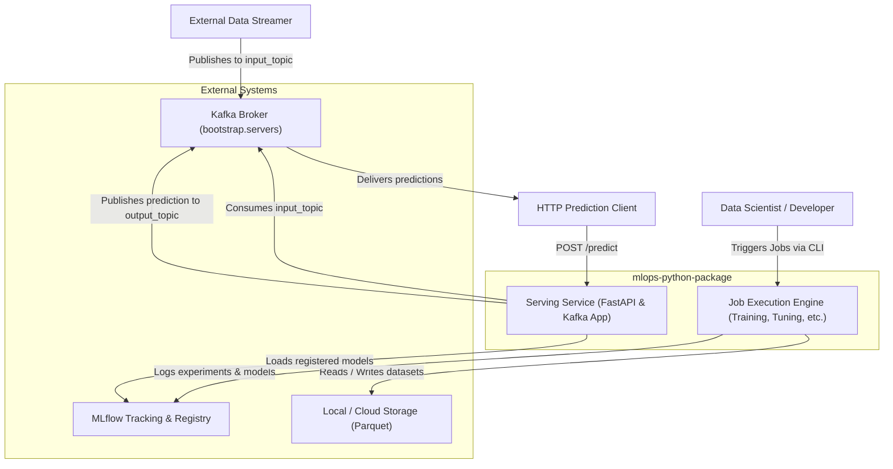

# System Context View: mlops-python-package

This viewpoint describes the boundaries of the MLOps Regression Service, outlining actors, external system dependencies, and incoming/outgoing data streams.

## 1. System Context Diagram

## 2. Interface Definitions & Boundaries

### MLflow Integration
- **Role:** Central repository for model tracking and model registration.
- **Protocol:** REST HTTP / gRPC via `mlflow` client.
- **Boundaries:** Configured using the `MLflowService` wrapper (`src/regression_model_template/io/services.py:L130-L195`).

### Kafka Broker
- **Role:** Real-time data streaming message queue.
- **Protocol:** Kafka Protocol via `confluent_kafka` C-extension client.
- **Topics:**
  - `input_topic` (Default): Receives features payload dictionaries.
  - `output_topic` (Default): Emits inference results with predicted output values.

### Storage Interface
- **Role:** Handles batch inputs and outputs.
- **Protocol:** Filesystem I/O via Pandas/PyArrow.
- **Formats:** Parquet dataset readers and writers (`src/regression_model_template/io/datasets.py:L10-L100`).

## 3. Actor Roles & Interactions

- **Data Scientist:** Triggers pipeline jobs (`training`, `tuning`, `evaluations`, `promotion`, `explanations`, `inference`) via CLI entry points.
- **Prediction Client:** Queries predictions in real-time using either HTTP endpoints or asynchronous Kafka message streams.
