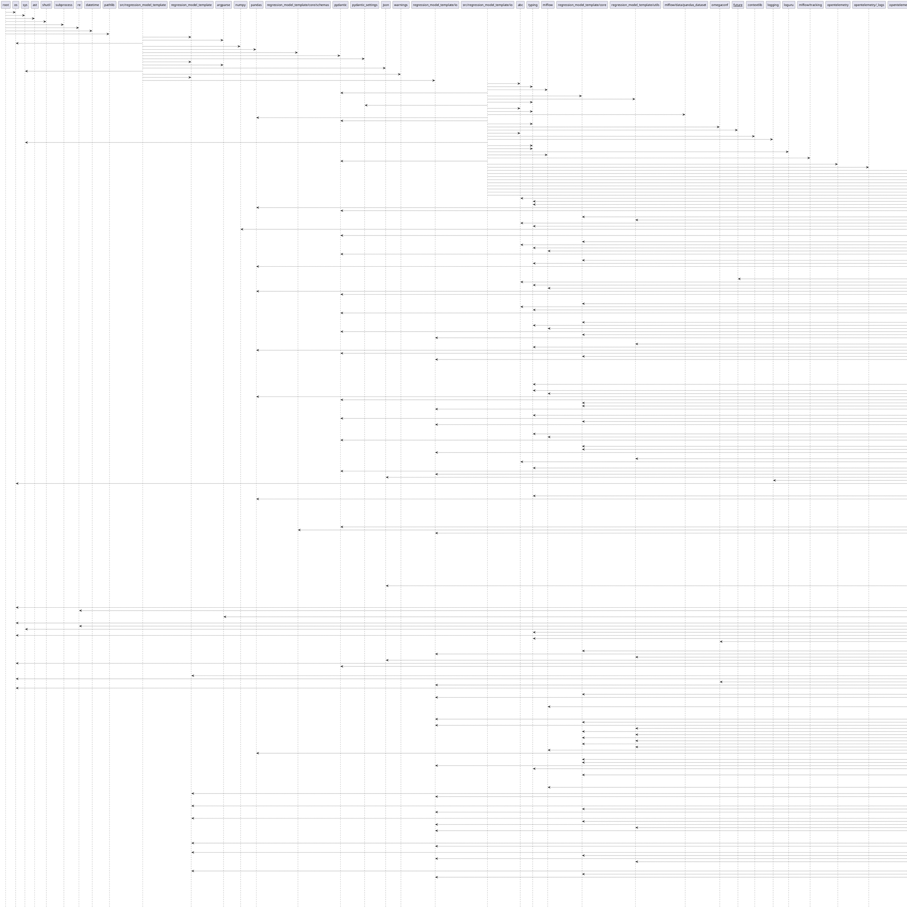

# Dependency Graph

```plantuml
@startuml
"root" --> "os"
"root" --> "sys"
"root" --> "ast"
"root" --> "shutil"
"root" --> "subprocess"
"root" --> "re"
"root" --> "datetime"
"root" --> "pathlib"
"src/regression_model_template" --> "regression_model_template"
"src/regression_model_template" --> "argparse"
"src/regression_model_template" --> "os"
"src/regression_model_template" --> "numpy"
"src/regression_model_template" --> "pandas"
"src/regression_model_template" --> "regression_model_template/core/schemas"
"src/regression_model_template" --> "pydantic"
"src/regression_model_template" --> "pydantic_settings"
"src/regression_model_template" --> "regression_model_template"
"src/regression_model_template" --> "argparse"
"src/regression_model_template" --> "json"
"src/regression_model_template" --> "sys"
"src/regression_model_template" --> "warnings"
"src/regression_model_template" --> "regression_model_template"
"src/regression_model_template" --> "regression_model_template/io"
"src/regression_model_template/io" --> "abc"
"src/regression_model_template/io" --> "typing"
"src/regression_model_template/io" --> "mlflow"
"src/regression_model_template/io" --> "pydantic"
"src/regression_model_template/io" --> "regression_model_template/core"
"src/regression_model_template/io" --> "regression_model_template/utils"
"src/regression_model_template/io" --> "typing"
"src/regression_model_template/io" --> "pydantic_settings"
"src/regression_model_template/io" --> "abc"
"src/regression_model_template/io" --> "typing"
"src/regression_model_template/io" --> "mlflow/data/pandas_dataset"
"src/regression_model_template/io" --> "pandas"
"src/regression_model_template/io" --> "pydantic"
"src/regression_model_template/io" --> "typing"
"src/regression_model_template/io" --> "omegaconf"
"src/regression_model_template/io" --> "__future__"
"src/regression_model_template/io" --> "abc"
"src/regression_model_template/io" --> "contextlib"
"src/regression_model_template/io" --> "logging"
"src/regression_model_template/io" --> "sys"
"src/regression_model_template/io" --> "typing"
"src/regression_model_template/io" --> "typing"
"src/regression_model_template/io" --> "loguru"
"src/regression_model_template/io" --> "mlflow"
"src/regression_model_template/io" --> "mlflow/tracking"
"src/regression_model_template/io" --> "pydantic"
"src/regression_model_template/io" --> "opentelemetry"
"src/regression_model_template/io" --> "opentelemetry/_logs"
"src/regression_model_template/io" --> "opentelemetry/exporter/otlp/proto/http/_log_exporter"
"src/regression_model_template/io" --> "opentelemetry/exporter/otlp/proto/http/trace_exporter"
"src/regression_model_template/io" --> "opentelemetry/sdk/_logs"
"src/regression_model_template/io" --> "opentelemetry/sdk/_logs/export"
"src/regression_model_template/io" --> "opentelemetry/sdk/resources"
"src/regression_model_template/io" --> "opentelemetry/sdk/trace"
"src/regression_model_template/io" --> "opentelemetry/sdk/trace/export"
"src/regression_model_template/io" --> "plyer"
"src/regression_model_template/io" --> "regression_model_template/io/osvariables"
"src/regression_model_template/utils" --> "abc"
"src/regression_model_template/utils" --> "typing"
"src/regression_model_template/utils" --> "typing"
"src/regression_model_template/utils" --> "pandas"
"src/regression_model_template/utils" --> "pydantic"
"src/regression_model_template/utils" --> "sklearn"
"src/regression_model_template/utils" --> "regression_model_template/core"
"src/regression_model_template/utils" --> "regression_model_template/utils"
"src/regression_model_template/utils" --> "abc"
"src/regression_model_template/utils" --> "typing"
"src/regression_model_template/utils" --> "numpy"
"src/regression_model_template/utils" --> "numpy/typing"
"src/regression_model_template/utils" --> "pydantic"
"src/regression_model_template/utils" --> "sklearn"
"src/regression_model_template/utils" --> "regression_model_template/core"
"src/regression_model_template/utils" --> "abc"
"src/regression_model_template/utils" --> "typing"
"src/regression_model_template/utils" --> "mlflow"
"src/regression_model_template/utils" --> "pydantic"
"src/regression_model_template/utils" --> "mlflow/models"
"src/regression_model_template/utils" --> "regression_model_template/core"
"src/regression_model_template/core" --> "typing"
"src/regression_model_template/core" --> "pandas"
"src/regression_model_template/core" --> "pandera"
"src/regression_model_template/core" --> "pandera/typing"
"src/regression_model_template/core" --> "pandera/typing/common"
"src/regression_model_template/core" --> "__future__"
"src/regression_model_template/core" --> "abc"
"src/regression_model_template/core" --> "typing"
"src/regression_model_template/core" --> "mlflow"
"src/regression_model_template/core" --> "pandas"
"src/regression_model_template/core" --> "pydantic"
"src/regression_model_template/core" --> "mlflow/metrics"
"src/regression_model_template/core" --> "sklearn"
"src/regression_model_template/core" --> "regression_model_template/core"
"src/regression_model_template/core" --> "abc"
"src/regression_model_template/core" --> "typing"
"src/regression_model_template/core" --> "pydantic"
"src/regression_model_template/core" --> "shap"
"src/regression_model_template/core" --> "sklearn"
"src/regression_model_template/core" --> "regression_model_template/core"
"src/regression_model_template/jobs" --> "typing"
"src/regression_model_template/jobs" --> "mlflow"
"src/regression_model_template/jobs" --> "pydantic"
"src/regression_model_template/jobs" --> "regression_model_template/core"
"src/regression_model_template/jobs" --> "regression_model_template/io"
"src/regression_model_template/jobs" --> "regression_model_template/jobs"
"src/regression_model_template/jobs" --> "regression_model_template/utils"
"src/regression_model_template/jobs" --> "typing"
"src/regression_model_template/jobs" --> "pandas"
"src/regression_model_template/jobs" --> "pydantic"
"src/regression_model_template/jobs" --> "regression_model_template/core"
"src/regression_model_template/jobs" --> "regression_model_template/io"
"src/regression_model_template/jobs" --> "regression_model_template/jobs"
"src/regression_model_template/jobs" --> "regression_model_template/jobs/evaluations"
"src/regression_model_template/jobs" --> "regression_model_template/jobs/explanations"
"src/regression_model_template/jobs" --> "regression_model_template/jobs/inference"
"src/regression_model_template/jobs" --> "regression_model_template/jobs/promotion"
"src/regression_model_template/jobs" --> "regression_model_template/jobs/training"
"src/regression_model_template/jobs" --> "regression_model_template/jobs/tuning"
"src/regression_model_template/jobs" --> "typing"
"src/regression_model_template/jobs" --> "regression_model_template/jobs"
"src/regression_model_template/jobs" --> "typing"
"src/regression_model_template/jobs" --> "mlflow"
"src/regression_model_template/jobs" --> "pandas"
"src/regression_model_template/jobs" --> "pydantic"
"src/regression_model_template/jobs" --> "regression_model_template/core"
"src/regression_model_template/jobs" --> "regression_model_template/core"
"src/regression_model_template/jobs" --> "regression_model_template/io"
"src/regression_model_template/jobs" --> "regression_model_template/jobs"
"src/regression_model_template/jobs" --> "typing"
"src/regression_model_template/jobs" --> "pydantic"
"src/regression_model_template/jobs" --> "regression_model_template/core"
"src/regression_model_template/jobs" --> "regression_model_template/io"
"src/regression_model_template/jobs" --> "regression_model_template/jobs"
"src/regression_model_template/jobs" --> "time"
"src/regression_model_template/jobs" --> "typing"
"src/regression_model_template/jobs" --> "mlflow"
"src/regression_model_template/jobs" --> "pydantic"
"src/regression_model_template/jobs" --> "mlflow/entities"
"src/regression_model_template/jobs" --> "regression_model_template/core"
"src/regression_model_template/jobs" --> "regression_model_template/core"
"src/regression_model_template/jobs" --> "regression_model_template/io"
"src/regression_model_template/jobs" --> "regression_model_template/jobs"
"src/regression_model_template/jobs" --> "regression_model_template/utils"
"src/regression_model_template/jobs" --> "abc"
"src/regression_model_template/jobs" --> "types"
"src/regression_model_template/jobs" --> "typing"
"src/regression_model_template/jobs" --> "pydantic"
"src/regression_model_template/jobs" --> "regression_model_template/io"
"src/regression_model_template/controller" --> "json"
"src/regression_model_template/controller" --> "logging"
"src/regression_model_template/controller" --> "os"
"src/regression_model_template/controller" --> "threading"
"src/regression_model_template/controller" --> "time"
"src/regression_model_template/controller" --> "collections"
"src/regression_model_template/controller" --> "typing"
"src/regression_model_template/controller" --> "pandas"
"src/regression_model_template/controller" --> "uvicorn"
"src/regression_model_template/controller" --> "confluent_kafka"
"src/regression_model_template/controller" --> "confluent_kafka/admin"
"src/regression_model_template/controller" --> "fastapi"
"src/regression_model_template/controller" --> "fastapi/concurrency"
"src/regression_model_template/controller" --> "fastapi/middleware/cors"
"src/regression_model_template/controller" --> "fastapi/middleware/trustedhost"
"src/regression_model_template/controller" --> "uvicorn/middleware/proxy_headers"
"src/regression_model_template/controller" --> "pydantic"
"src/regression_model_template/controller" --> "regression_model_template/core/schemas"
"src/regression_model_template/controller" --> "regression_model_template/io"
"src/regression_model_template/controller" --> "regression_model_template/io/registries"
"tasks" --> "invoke/context"
"tasks" --> "invoke/tasks"
"tasks" --> "invoke/context"
"tasks" --> "invoke/tasks"
"tasks" --> "invoke/context"
"tasks" --> "invoke/tasks"
"tasks" --> "invoke/context"
"tasks" --> "invoke/tasks"
"tasks" --> "invoke/context"
"tasks" --> "invoke/tasks"
"tasks" --> "invoke/context"
"tasks" --> "invoke/tasks"
"tasks" --> "invoke"
"tasks" --> "invoke/context"
"tasks" --> "invoke/tasks"
"tasks" --> "json"
"tasks" --> "invoke/context"
"tasks" --> "invoke/tasks"
"tasks" --> "invoke/context"
"tasks" --> "invoke/tasks"
"tasks" --> "invoke/context"
"tasks" --> "invoke/tasks"
"skills/validate/scripts" --> "os"
"skills/validate/scripts" --> "re"
"skills/validate/scripts" --> "glob"
"skills/validate/scripts" --> "argparse"
"skills/validate/scripts" --> "glob"
"skills/validate/scripts" --> "os"
"skills/validate/scripts" --> "re"
"skills/validate/scripts" --> "sys"
"skills/validate/scripts" --> "typing"
"tests" --> "os"
"tests" --> "typing"
"tests" --> "omegaconf"
"tests" --> "pytest"
"tests" --> "_pytest"
"tests" --> "regression_model_template/core"
"tests" --> "regression_model_template/io"
"tests" --> "regression_model_template/utils"
"tests" --> "json"
"tests" --> "os"
"tests" --> "pydantic"
"tests" --> "pytest"
"tests" --> "_pytest"
"tests" --> "regression_model_template"
"tests/io" --> "os"
"tests/io" --> "omegaconf"
"tests/io" --> "regression_model_template/io"
"tests/io" --> "os"
"tests/io" --> "pytest"
"tests/io" --> "regression_model_template/core"
"tests/io" --> "regression_model_template/io"
"tests/io" --> "_pytest/capture"
"tests/io" --> "_pytest/logging"
"tests/io" --> "mlflow"
"tests/io" --> "plyer"
"tests/io" --> "pytest"
"tests/io" --> "pytest_mock"
"tests/io" --> "regression_model_template/io"
"tests/io" --> "regression_model_template/core"
"tests/io" --> "regression_model_template/io"
"tests/io" --> "regression_model_template/utils"
"tests/utils" --> "regression_model_template/core"
"tests/utils" --> "regression_model_template/utils"
"tests/utils" --> "regression_model_template/core"
"tests/utils" --> "regression_model_template/utils"
"tests/utils" --> "regression_model_template/core"
"tests/utils" --> "regression_model_template/utils"
"tests/core" --> "mlflow"
"tests/core" --> "pandas"
"tests/core" --> "pytest"
"tests/core" --> "regression_model_template/core"
"tests/core" --> "regression_model_template/core"
"tests/core" --> "regression_model_template/io"
"tests/core" --> "typing"
"tests/core" --> "pytest"
"tests/core" --> "regression_model_template/core"
"tests/performance" --> "asyncio"
"tests/performance" --> "time"
"tests/jobs" --> "_pytest/capture"
"tests/jobs" --> "mlflow"
"tests/jobs" --> "pytest"
"tests/jobs" --> "regression_model_template"
"tests/jobs" --> "regression_model_template/io"
"tests/jobs" --> "_pytest/capture"
"tests/jobs" --> "pytest"
"tests/jobs" --> "regression_model_template"
"tests/jobs" --> "regression_model_template/core"
"tests/jobs" --> "regression_model_template/io"
"tests/jobs" --> "_pytest/capture"
"tests/jobs" --> "regression_model_template"
"tests/jobs" --> "regression_model_template/core"
"tests/jobs" --> "regression_model_template/io"
"tests/jobs" --> "regression_model_template/utils"
"tests/jobs" --> "regression_model_template/io"
"tests/jobs" --> "regression_model_template/jobs"
"tests/jobs" --> "_pytest/capture"
"tests/jobs" --> "pytest"
"tests/jobs" --> "regression_model_template"
"tests/jobs" --> "regression_model_template/io"
"tests/jobs" --> "_pytest/capture"
"tests/jobs" --> "regression_model_template"
"tests/jobs" --> "regression_model_template/core"
"tests/jobs" --> "regression_model_template/io"
"tests/jobs" --> "regression_model_template/utils"
"tests/jobs" --> "_pytest/capture"
"tests/jobs" --> "pytest"
"tests/jobs" --> "regression_model_template"
"tests/jobs" --> "regression_model_template/core"
"tests/jobs" --> "regression_model_template/io"
"tests/controller" --> "asyncio"
"tests/controller" --> "unittest/mock"
"tests/controller" --> "pytest"
"tests/controller" --> "fastapi"
"tests/controller" --> "regression_model_template/controller/kafka_app"
"tests/controller" --> "fastapi/middleware/cors"
"tests/controller" --> "fastapi/middleware/trustedhost"
"tests/controller" --> "regression_model_template/controller"
"tests/controller" --> "importlib"
"tests/controller" --> "pytest"
"tests/controller" --> "os"
"tests/controller" --> "pytest"
"tests/controller" --> "pydantic"
"tests/controller" --> "regression_model_template/controller/kafka_app"
"tests/controller" --> "time"
"tests/controller" --> "regression_model_template/controller/kafka_app"
"tests/controller" --> "json"
"tests/controller" --> "unittest/mock"
"tests/controller" --> "pytest"
"tests/controller" --> "confluent_kafka"
"tests/controller" --> "fastapi"
"tests/controller" --> "regression_model_template/controller/kafka_app"
"tests/controller" --> "pytest"
"tests/controller" --> "logging"
"tests/controller" --> "unittest/mock"
"tests/controller" --> "regression_model_template/controller/kafka_app"
"tests/controller" --> "pandas"
"tests/controller" --> "json"
"tests/controller" --> "pytest"
"tests/controller" --> "unittest/mock"
"tests/controller" --> "regression_model_template/controller/kafka_app"
"tests/controller" --> "os"
"tests/controller" --> "subprocess"
"tests/controller" --> "sys"
"tests/controller" --> "time"
"tests/controller" --> "requests"
"tests/controller" --> "json"
"tests/controller" --> "unittest/mock"
"tests/controller" --> "regression_model_template/controller/kafka_app"
@enduml
```
