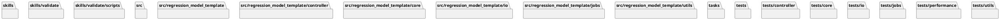

# Package Diagram

```plantuml
@startuml
package "skills" {}
package "skills/validate" {}
package "skills/validate/scripts" {}
package "src" {}
package "src/regression_model_template" {}
package "src/regression_model_template/controller" {}
package "src/regression_model_template/core" {}
package "src/regression_model_template/io" {}
package "src/regression_model_template/jobs" {}
package "src/regression_model_template/utils" {}
package "tasks" {}
package "tests" {}
package "tests/controller" {}
package "tests/core" {}
package "tests/io" {}
package "tests/jobs" {}
package "tests/performance" {}
package "tests/utils" {}
@enduml
```
