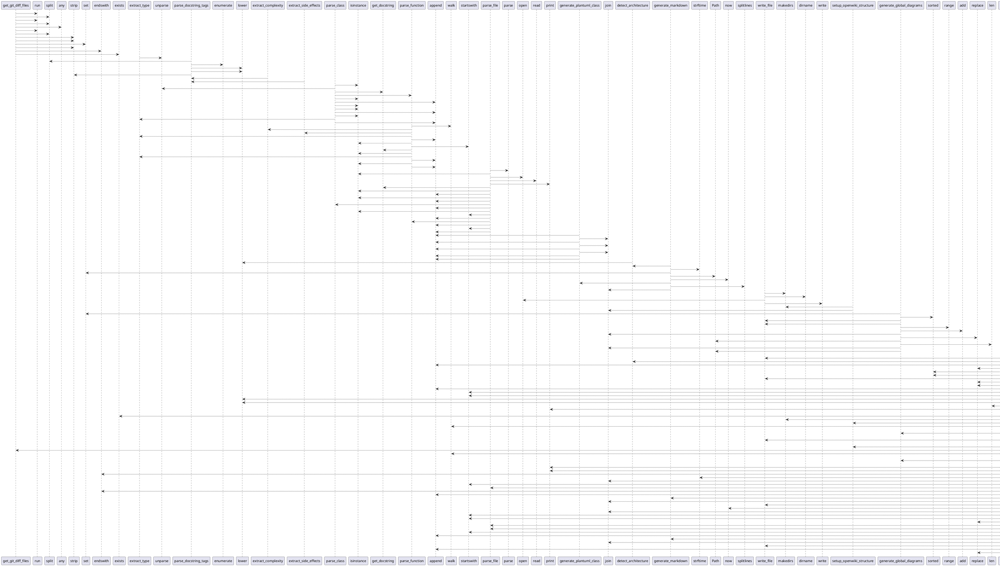

# Module: `generate_openwiki.py`

## Overview
**Purpose**: Module providing various functionalities.

**Architecture Role**: Infrastructure

**Dependencies**:
- `ast`
- `shutil`
- `datetime`
- `sys`
- `re`
- `pathlib`
- `subprocess`
- `os`

**Exported Symbols**:
- `get_git_diff_files`
- `extract_type`
- `parse_docstring_tags`
- `extract_complexity`
- `extract_side_effects`
- `parse_class`
- `parse_function`
- `parse_file`
- `generate_plantuml_class`
- `detect_architecture`
- `generate_markdown`
- `write_file`
- `setup_openwiki_structure`
- `generate_global_diagrams`
- `generate_architecture`
- `generate_summary`
- `main`

## UML Class Diagram

## Call Graph

## Classes
## Functions
### Function `get_git_diff_files`
- **Description**: No description available.
- **Inputs**:
- **Output**: `Any`
- **Side Effects**: Not documented
- **Complexity**: Not documented

### Function `extract_type`
- **Description**: No description available.
- **Inputs**:
  - `annotation`: Any
- **Output**: `Any`
- **Side Effects**: Not documented
- **Complexity**: Not documented

### Function `parse_docstring_tags`
- **Description**: Simple parser to find things like Time O(N) or Side Effects: ... in docstrings.
- **Inputs**:
  - `docstring`: Any
  - `tag`: Any
- **Output**: `Any`
- **Side Effects**: Simple parser to find things like Time O(N) or Side Effects: ... in docstrings.
- **Complexity**: Not documented

### Function `extract_complexity`
- **Description**: No description available.
- **Inputs**:
  - `docstring`: Any
- **Output**: `Any`
- **Side Effects**: Not documented
- **Complexity**: Not documented

### Function `extract_side_effects`
- **Description**: No description available.
- **Inputs**:
  - `docstring`: Any
- **Output**: `Any`
- **Side Effects**: Not documented
- **Complexity**: Not documented

### Function `parse_class`
- **Description**: No description available.
- **Inputs**:
  - `node`: Any
- **Output**: `Any`
- **Side Effects**: Not documented
- **Complexity**: Not documented

### Function `parse_function`
- **Description**: No description available.
- **Inputs**:
  - `node`: Any
- **Output**: `Any`
- **Side Effects**: Not documented
- **Complexity**: Not documented

### Function `parse_file`
- **Description**: No description available.
- **Inputs**:
  - `filepath`: Any
- **Output**: `Any`
- **Side Effects**: Not documented
- **Complexity**: Not documented

### Function `generate_plantuml_class`
- **Description**: No description available.
- **Inputs**:
  - `cls_info`: Any
- **Output**: `Any`
- **Side Effects**: Not documented
- **Complexity**: Not documented

### Function `detect_architecture`
- **Description**: No description available.
- **Inputs**:
  - `filepath`: Any
- **Output**: `Any`
- **Side Effects**: Not documented
- **Complexity**: Not documented

### Function `generate_markdown`
- **Description**: No description available.
- **Inputs**:
  - `module_info`: Any
- **Output**: `Any`
- **Side Effects**: Not documented
- **Complexity**: Not documented

### Function `write_file`
- **Description**: No description available.
- **Inputs**:
  - `path`: Any
  - `content`: Any
- **Output**: `Any`
- **Side Effects**: Not documented
- **Complexity**: Not documented

### Function `setup_openwiki_structure`
- **Description**: No description available.
- **Inputs**:
- **Output**: `Any`
- **Side Effects**: Not documented
- **Complexity**: Not documented

### Function `generate_global_diagrams`
- **Description**: No description available.
- **Inputs**:
  - `modules`: Any
- **Output**: `Any`
- **Side Effects**: Not documented
- **Complexity**: Not documented

### Function `generate_architecture`
- **Description**: No description available.
- **Inputs**:
  - `modules`: Any
- **Output**: `Any`
- **Side Effects**: Not documented
- **Complexity**: Not documented

### Function `generate_summary`
- **Description**: No description available.
- **Inputs**:
  - `modules`: Any
- **Output**: `Any`
- **Side Effects**: Not documented
- **Complexity**: Not documented

### Function `main`
- **Description**: No description available.
- **Inputs**:
- **Output**: `Any`
- **Side Effects**: Not documented
- **Complexity**: Not documented
