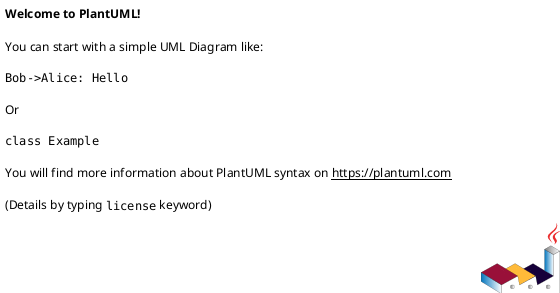

<!-- AUTOGENERATED_START -->
# src/regression_model_template/__main__.py

## Module Overview
Entry point of the package.

## Dependencies
- `regression_model_template`

## Public API
## Classes
## UML

<!-- AUTOGENERATED_END -->
