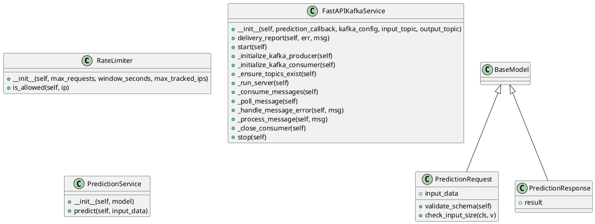

<!-- AUTOGENERATED_START -->
# src/regression_model_template/controller/kafka_app.py

## Module Overview
FastAPI and Kafka Service for Predictions with Logging.

## Dependencies
- `json`
- `logging`
- `os`
- `threading`
- `time`
- `collections`
- `typing`
- `pandas`
- `uvicorn`
- `confluent_kafka`
- `confluent_kafka.admin`
- `fastapi`
- `fastapi.concurrency`
- `fastapi.middleware.cors`
- `fastapi.middleware.trustedhost`
- `uvicorn.middleware.proxy_headers`
- `pydantic`
- `regression_model_template.core.schemas`
- `regression_model_template.io`
- `regression_model_template.io.registries`

## Public API
### Function `add_security_headers`
Middleware to add security headers to HTTP responses.
- **Arguments:** request, call_next
- **Returns:** Any

### Function `default_input_payload`
Generate a fresh default input payload with current timestamps.
- **Arguments:**
- **Returns:** Dict[str, Any]

### Function `predict`
Endpoint for making predictions via HTTP.
- **Arguments:** request_data, request
- **Returns:** PredictionResponse

### Function `health_check`
Simple health check endpoint to verify that the service is running.
- **Arguments:**
- **Returns:** dict[str, str]

### Function `main`
- **Arguments:**
- **Returns:** None

## Classes
### Class `RateLimiter`
In-memory sliding window rate limiter backed by OrderedDict.
- **Bases:** None

#### Attributes
None

#### Methods
##### `__init__`
- **Arguments:** self, max_requests, window_seconds, max_tracked_ips
- **Returns:** None

##### `is_allowed`
Check if the given IP is allowed to make a request.
- **Arguments:** self, ip
- **Returns:** bool

### Class `PredictionRequest`
Request model for prediction.
- **Bases:** BaseModel

#### Attributes
- `input_data`

#### Methods
##### `validate_schema`
Validates the input data against InputsSchema.
- **Arguments:** self
- **Returns:** pd.DataFrame

##### `check_input_size`
Check if the input data size is within limits.
- **Arguments:** cls, v
- **Returns:** Dict[str, Any]

### Class `PredictionResponse`
Response model for prediction.
- **Bases:** BaseModel

#### Attributes
- `result`

#### Methods
### Class `FastAPIKafkaService`
Service for deploying a FastAPI application with a Kafka producer and consumer.
- **Bases:** None

#### Attributes
None

#### Methods
##### `__init__`
- **Arguments:** self, prediction_callback, kafka_config, input_topic, output_topic
- **Returns:** None

##### `delivery_report`
Called once for each message produced to indicate delivery result.
- **Arguments:** self, err, msg
- **Returns:** None

##### `start`
Start the FastAPI application and Kafka consumer.
- **Arguments:** self
- **Returns:** None

##### `_initialize_kafka_producer`
Initialize Kafka producer.
- **Arguments:** self
- **Returns:** None

##### `_initialize_kafka_consumer`
Initialize Kafka consumer.
- **Arguments:** self
- **Returns:** None

##### `_ensure_topics_exist`
Ensure input and output Kafka topics exist on the broker.
- **Arguments:** self
- **Returns:** None

##### `_run_server`
Run the FastAPI server.
- **Arguments:** self
- **Returns:** None

##### `_consume_messages`
Consume messages from Kafka topic and produce predictions.
- **Arguments:** self
- **Returns:** None

##### `_poll_message`
Poll message from Kafka consumer.
- **Arguments:** self
- **Returns:** Message | None

##### `_handle_message_error`
Handle errors in polled messages.
- **Arguments:** self, msg
- **Returns:** bool

##### `_process_message`
Process a valid Kafka message.
- **Arguments:** self, msg
- **Returns:** None

##### `_close_consumer`
Close the Kafka consumer.
- **Arguments:** self
- **Returns:** None

##### `stop`
Stop the FastAPI application and Kafka consumer.
- **Arguments:** self
- **Returns:** None

### Class `PredictionService`
Service to handle prediction logic securely.
- **Bases:** None

#### Attributes
None

#### Methods
##### `__init__`
- **Arguments:** self, model
- **Returns:** None

##### `predict`
Make a prediction using the model.
- **Arguments:** self, input_data
- **Returns:** PredictionResponse

## UML

<!-- AUTOGENERATED_END -->
