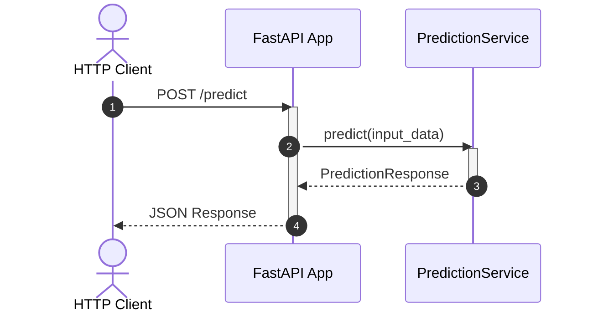

# Module Specification: kafka_app

* **Source Reference:** [src/regression_model_template/controller/kafka_app.py](../../../src/regression_model_template/controller/kafka_app.py) (Lines: L1-L501)

## 1. Architectural Role & Responsibilities
FastAPI and Kafka Service for Predictions with Logging.

## 2. UML 2.0 Class Diagram

```mermaid
classDiagram
    direction BT
    class RateLimiter {
        -__init__(self: Any, max_requests: int, window_seconds: int, max_tracked_ips: int) Any
        +is_allowed(self: Any, ip: str) bool
    }
    class PredictionRequest {
        +input_data: Dict[str, Any]
        +validate_schema(self: Any) pd.DataFrame
        +check_input_size(cls: Any, v: Dict[str, Any]) Dict[str, Any]
    }
    class PredictionResponse {
        +result: Dict[str, Any]
    }
    class FastAPIKafkaService {
        -__init__(self: Any, prediction_callback: Callable[[PredictionRequest], PredictionResponse], kafka_config: Dict[str, Any], input_topic: str, output_topic: str) Any
        +delivery_report(self: Any, err: KafkaError | None, msg: Message) None
        +start(self: Any) None
        -_initialize_kafka_producer(self: Any) None
        -_initialize_kafka_consumer(self: Any) None
        -_ensure_topics_exist(self: Any) None
        -_run_server(self: Any) None
        -_consume_messages(self: Any) None
        -_poll_message(self: Any) Message | None
        -_handle_message_error(self: Any, msg: Message) bool
        -_process_message(self: Any, msg: Message) None
        -_close_consumer(self: Any) None
        +stop(self: Any) None
    }
    class PredictionService {
        -__init__(self: Any, model: Any) Any
        +predict(self: Any, input_data: PredictionRequest) PredictionResponse
    }
```

## 2b. Execution Flow (Sequence Diagram)

## 3. Class & Method Specifications

### `RateLimiter` ([`src/regression_model_template/controller/kafka_app.py:L82-L112`](../../../src/regression_model_template/controller/kafka_app.py#L82-L112))

In-memory sliding window rate limiter backed by OrderedDict.

#### Methods

* **`__init__(self: Any, max_requests: int, window_seconds: int, max_tracked_ips: int) -> Any`** (L85-L89)
  - **Purpose**: No description available.
  - **Inputs**:
    - `self` (`Any`): Parameter description.
    - `max_requests` (`int`): Parameter description.
    - `window_seconds` (`int`): Parameter description.
    - `max_tracked_ips` (`int`): Parameter description.
  - **Outputs**:
    - `Any`: Return value description.

* **`is_allowed(self: Any, ip: str) -> bool`** (L91-L112)
  - **Purpose**: Check if the given IP is allowed to make a request.
  - **Inputs**:
    - `self` (`Any`): Parameter description.
    - `ip` (`str`): Parameter description.
  - **Outputs**:
    - `bool`: Return value description.

### Function: `default_input_payload() -> Dict[str, Any]` ([`src/regression_model_template/controller/kafka_app.py:L116-L135`](../../../src/regression_model_template/controller/kafka_app.py#L116-L135))

Generate a fresh default input payload with current timestamps.

### `PredictionRequest` ([`src/regression_model_template/controller/kafka_app.py:L138-L174`](../../../src/regression_model_template/controller/kafka_app.py#L138-L174))

Request model for prediction.

#### Methods

* **`validate_schema(self: Any) -> pd.DataFrame`** (L143-L145)
  - **Purpose**: Validates the input data against InputsSchema.
  - **Inputs**:
    - `self` (`Any`): Parameter description.
  - **Outputs**:
    - `pd.DataFrame`: Return value description.

* **`check_input_size(cls: Any, v: Dict[str, Any]) -> Dict[str, Any]`** (L149-L174)
  - **Purpose**: Check if the input data size is within limits.
  - **Inputs**:
    - `cls` (`Any`): Parameter description.
    - `v` (`Dict[str, Any]`): Parameter description.
  - **Outputs**:
    - `Dict[str, Any]`: Return value description.

### `PredictionResponse` ([`src/regression_model_template/controller/kafka_app.py:L177-L180`](../../../src/regression_model_template/controller/kafka_app.py#L177-L180))

Response model for prediction.

#### Methods

*No methods defined.*

### `FastAPIKafkaService` ([`src/regression_model_template/controller/kafka_app.py:L184-L386`](../../../src/regression_model_template/controller/kafka_app.py#L184-L386))

Service for deploying a FastAPI application with a Kafka producer and consumer.

#### Methods

* **`__init__(self: Any, prediction_callback: Callable[[PredictionRequest], PredictionResponse], kafka_config: Dict[str, Any], input_topic: str, output_topic: str) -> Any`** (L187-L201)
  - **Purpose**: No description available.
  - **Inputs**:
    - `self` (`Any`): Parameter description.
    - `prediction_callback` (`Callable[[PredictionRequest], PredictionResponse]`): Parameter description.
    - `kafka_config` (`Dict[str, Any]`): Parameter description.
    - `input_topic` (`str`): Parameter description.
    - `output_topic` (`str`): Parameter description.
  - **Outputs**:
    - `Any`: Return value description.

* **`delivery_report(self: Any, err: KafkaError | None, msg: Message) -> None`** (L203-L208)
  - **Purpose**: Called once for each message produced to indicate delivery result.
  - **Inputs**:
    - `self` (`Any`): Parameter description.
    - `err` (`KafkaError | None`): Parameter description.
    - `msg` (`Message`): Parameter description.
  - **Outputs**:
    - `None`: Return value description.

* **`start(self: Any) -> None`** (L210-L218)
  - **Purpose**: Start the FastAPI application and Kafka consumer.
  - **Inputs**:
    - `self` (`Any`): Parameter description.
  - **Outputs**:
    - `None`: Return value description.

* **`_initialize_kafka_producer(self: Any) -> None`** (L220-L230)
  - **Purpose**: Initialize Kafka producer.
  - **Inputs**:
    - `self` (`Any`): Parameter description.
  - **Outputs**:
    - `None`: Return value description.

* **`_initialize_kafka_consumer(self: Any) -> None`** (L232-L242)
  - **Purpose**: Initialize Kafka consumer.
  - **Inputs**:
    - `self` (`Any`): Parameter description.
  - **Outputs**:
    - `None`: Return value description.

* **`_ensure_topics_exist(self: Any) -> None`** (L244-L262)
  - **Purpose**: Ensure input and output Kafka topics exist on the broker.
  - **Inputs**:
    - `self` (`Any`): Parameter description.
  - **Outputs**:
    - `None`: Return value description.

* **`_run_server(self: Any) -> None`** (L264-L269)
  - **Purpose**: Run the FastAPI server.
  - **Inputs**:
    - `self` (`Any`): Parameter description.
  - **Outputs**:
    - `None`: Return value description.

* **`_consume_messages(self: Any) -> None`** (L271-L285)
  - **Purpose**: Consume messages from Kafka topic and produce predictions.
  - **Inputs**:
    - `self` (`Any`): Parameter description.
  - **Outputs**:
    - `None`: Return value description.

* **`_poll_message(self: Any) -> Message | None`** (L287-L293)
  - **Purpose**: Poll message from Kafka consumer.
  - **Inputs**:
    - `self` (`Any`): Parameter description.
  - **Outputs**:
    - `Message | None`: Return value description.

* **`_handle_message_error(self: Any, msg: Message) -> bool`** (L295-L318)
  - **Purpose**: Handle errors in polled messages.
  - **Inputs**:
    - `self` (`Any`): Parameter description.
    - `msg` (`Message`): Parameter description.
  - **Outputs**:
    - `bool`: Return value description.

* **`_process_message(self: Any, msg: Message) -> None`** (L320-L372)
  - **Purpose**: Process a valid Kafka message.
  - **Inputs**:
    - `self` (`Any`): Parameter description.
    - `msg` (`Message`): Parameter description.
  - **Outputs**:
    - `None`: Return value description.

* **`_close_consumer(self: Any) -> None`** (L374-L378)
  - **Purpose**: Close the Kafka consumer.
  - **Inputs**:
    - `self` (`Any`): Parameter description.
  - **Outputs**:
    - `None`: Return value description.

* **`stop(self: Any) -> None`** (L380-L386)
  - **Purpose**: Stop the FastAPI application and Kafka consumer.
  - **Inputs**:
    - `self` (`Any`): Parameter description.
  - **Outputs**:
    - `None`: Return value description.

### `PredictionService` ([`src/regression_model_template/controller/kafka_app.py:L442-L462`](../../../src/regression_model_template/controller/kafka_app.py#L442-L462))

Service to handle prediction logic securely.

#### Methods

* **`__init__(self: Any, model: Any) -> Any`** (L445-L446)
  - **Purpose**: No description available.
  - **Inputs**:
    - `self` (`Any`): Parameter description.
    - `model` (`Any`): Parameter description.
  - **Outputs**:
    - `Any`: Return value description.

* **`predict(self: Any, input_data: PredictionRequest) -> PredictionResponse`** (L448-L462)
  - **Purpose**: Make a prediction using the model.
  - **Inputs**:
    - `self` (`Any`): Parameter description.
    - `input_data` (`PredictionRequest`): Parameter description.
  - **Outputs**:
    - `PredictionResponse`: Return value description.

### Function: `main() -> None` ([`src/regression_model_template/controller/kafka_app.py:L465-L496`](../../../src/regression_model_template/controller/kafka_app.py#L465-L496))

No description available.
