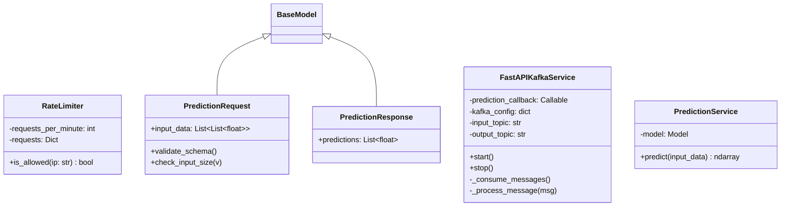

# Module Specification: Real-Time Kafka Streaming & FastAPI Controller

* **Source File Reference:** `[[src/regression_model_template/controller/kafka_app.py](../../../../src/regression_model_template/controller/kafka_app.py)](../../../../[src/regression_model_template/controller/kafka_app.py](../../../../src/regression_model_template/controller/kafka_app.py))` (Lines: L1-L462)
* **Upstream Dependencies:** [Modules/RegressionModelTemplate/Core/Models](../core/models.md), `confluent_kafka`, `fastapi`, `pydantic`
* **Downstream Consumers:** Prediction API Clients, Apache Kafka Cluster

## 1. Architectural Role & Responsibilities
`kafka_app.py` implements an enterprise real-time streaming controller combining a Kafka consumer/producer event loop with embedded FastAPI endpoints (`/health`, `/metrics`, `/predict`). Includes sliding-window IP rate limiting (`RateLimiter`) and Pydantic request validation (`PredictionRequest`).

## 2. UML 2.0 Class Diagram

## 3. Comprehensive Class & Method Contracts

### `RateLimiter` (`[[src/regression_model_template/controller/kafka_app.py:L70-L112](../../../../src/regression_model_template/controller/kafka_app.py#L70-L112)](../../../../[src/regression_model_template/controller/kafka_app.py](../../../../src/regression_model_template/controller/kafka_app.py)#L70-L112)`)
* `is_allowed(self, ip: str) -> bool` (L91-L112): Checks if IP exceeds sliding window request threshold. Returns `True` if request permitted.

### `FastAPIKafkaService` (`[[src/regression_model_template/controller/kafka_app.py:L184-L386](../../../../src/regression_model_template/controller/kafka_app.py#L184-L386)](../../../../[src/regression_model_template/controller/kafka_app.py](../../../../src/regression_model_template/controller/kafka_app.py)#L184-L386)`)
* `__init__(self, prediction_callback, kafka_config, input_topic, output_topic)` (L187-L201)
* `start(self)` (L210-L218): Starts background Kafka consumer loop and launches uvicorn ASGI web server.
* `_process_message(self, msg)` (L320-L372): Deserializes JSON message, invokes model prediction callback, and produces response record to output topic.
* `stop(self)` (L380-L386): Gracefully closes Kafka consumer/producer and terminates server thread.

### `PredictionService` (`[[src/regression_model_template/controller/kafka_app.py:L442-L462](../../../../src/regression_model_template/controller/kafka_app.py#L442-L462)](../../../../[src/regression_model_template/controller/kafka_app.py](../../../../src/regression_model_template/controller/kafka_app.py)#L442-L462)`)
* `predict(self, input_data: List[List[float]]) -> np.ndarray` (L448-L462): Runs regression model prediction for incoming batch matrix.
