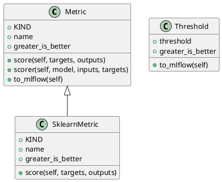

<!-- AUTOGENERATED_START -->
# src/regression_model_template/core/metrics.py

## Module Overview
Evaluate model performances with metrics.

## Dependencies
- `__future__`
- `abc`
- `typing`
- `mlflow`
- `pandas`
- `pydantic`
- `mlflow.metrics`
- `sklearn`
- `regression_model_template.core`

## Public API
## Classes
### Class `Metric`
Base class for a project metric.

Use metrics to evaluate model performance.
e.g., accuracy, precision, recall, MAE, F1, ...

Parameters:
    name (str): name of the metric for the reporting.
    greater_is_better (bool): maximize or minimize result.
- **Bases:** None

#### Attributes
- `KIND`
- `name`
- `greater_is_better`

#### Methods
##### `score`
Score the outputs against the targets.

Args:
    targets (schemas.Targets): expected values.
    outputs (schemas.Outputs): predicted values.

Returns:
    float: single result from the metric computation.
- **Arguments:** self, targets, outputs
- **Returns:** float

##### `scorer`
Score model outputs against targets.

Args:
    model (models.Model): model to evaluate.
    inputs (schemas.Inputs): model inputs values.
    targets (schemas.Targets): model expected values.

Returns:
    float: single result from the metric computation.
- **Arguments:** self, model, inputs, targets
- **Returns:** float

##### `to_mlflow`
Convert the metric to an Mlflow metric.

Returns:
    MlflowMetric: the Mlflow metric.
- **Arguments:** self
- **Returns:** MlflowMetric

### Class `SklearnMetric`
Compute metrics with sklearn.

Parameters:
    name (str): name of the sklearn metric.
    greater_is_better (bool): maximize or minimize.
- **Bases:** Metric

#### Attributes
- `KIND`
- `name`
- `greater_is_better`

#### Methods
##### `score`
- **Arguments:** self, targets, outputs
- **Returns:** float

### Class `Threshold`
A project threshold for a metric.

Use thresholds to monitor model performances.
e.g., to trigger an alert when a threshold is met.

Parameters:
    threshold (int | float): absolute threshold value.
    greater_is_better (bool): maximize or minimize result.
- **Bases:** None

#### Attributes
- `threshold`
- `greater_is_better`

#### Methods
##### `to_mlflow`
Convert the threshold to an mlflow threshold.

Returns:
    MlflowThreshold: the mlflow threshold.
- **Arguments:** self
- **Returns:** MlflowThreshold

## UML

<!-- AUTOGENERATED_END -->
