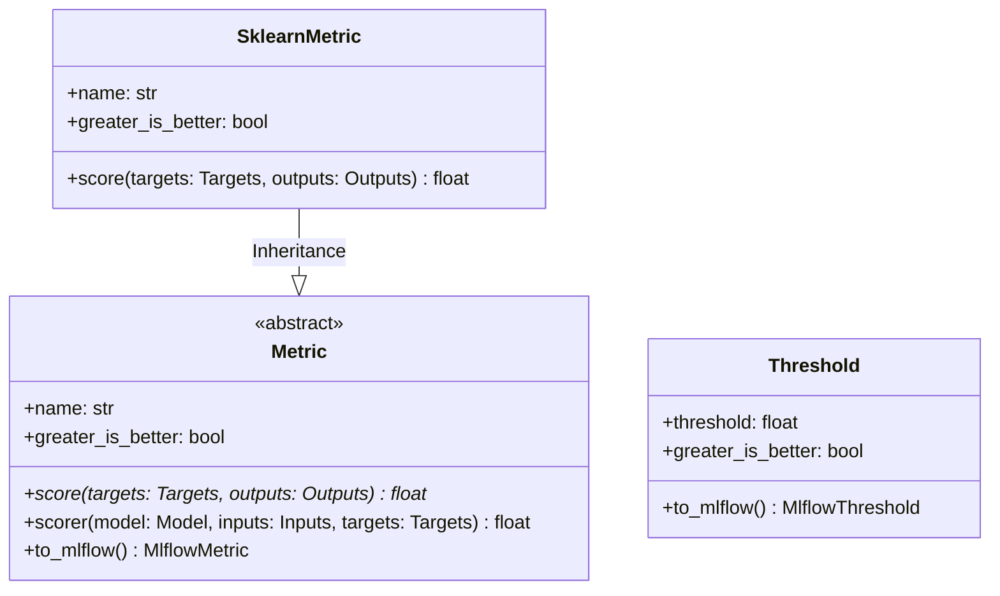

# Module Specification: Metrics & Evaluation Scorers

* **Source File Reference:** [`src/regression_model_template/core/metrics.py`](/src/regression_model_template/core/metrics.py) (Lines: L1-L149)
* **Upstream Dependencies:** `scikit-learn`, `mlflow`
* **Downstream Consumers:** [Modules/RegressionModelTemplate/Jobs/Evaluations](../jobs/evaluations.md), [Modules/RegressionModelTemplate/Jobs/Training](../jobs/training.md), [Modules/RegressionModelTemplate/Jobs/Tuning](../jobs/tuning.md)

## 1. Architectural Role & Responsibilities
`metrics.py` provides uniform metric wrappers for regression evaluation. Supports calculating RMSE, MAE, R2 scores, generating Scikit-Learn custom scorers, and logging evaluation metrics directly to MLflow.

## 2. UML 2.0 Class Diagram

## 3. Class & Method Specifications

### `Metric` ([`src/regression_model_template/core/metrics.py:L27-L95`](/src/regression_model_template/core/metrics.py#L27-L95))

`Metric` is the abstract base class and Pydantic model for project-level evaluation metrics. It standardizes the reporting interface for model validation, handling metric optimization directions (maximizing vs. minimizing) and exporting metric wrappers to MLflow and Scikit-Learn evaluation pipelines.

#### Methods

* **`score(self, targets: schemas.Targets, outputs: schemas.Outputs) -> float`** (L44-L53)
  - **Purpose**: Abstract core method that computes the metric's performance score by comparing expected targets with predicted model outputs.
  - **Inputs**:
    - `targets` (`schemas.Targets` / `pandas.DataFrame`): The ground truth expected target labels.
    - `outputs` (`schemas.Outputs` / `pandas.DataFrame`): The predictions output by the model.
  - **Outputs**:
    - `float`: The computed metric score.

* **`scorer(self, model: models.Model, inputs: schemas.Inputs, targets: schemas.Targets) -> float`** (L55-L68)
  - **Purpose**: Helper wrapper that evaluates the metric directly on a model instance by running inference on new inputs and passing the predictions alongside ground truth labels to the `score()` method. Compatible with standard Scikit-Learn evaluation calls.
  - **Inputs**:
    - `model` (`models.Model`): The model instance to evaluate.
    - `inputs` (`schemas.Inputs` / `pandas.DataFrame`): Feature matrix containing sample rows.
    - `targets` (`schemas.Targets` / `pandas.DataFrame`): Ground truth target labels.
  - **Outputs**:
    - `float`: The computed metric score for the model's predictions.

* **`to_mlflow(self) -> MlflowMetric`** (L70-L95)
  - **Purpose**: Converts the project metric into a standard MLflow compatible metric wrapper. Internally constructs an evaluation function that processes predictions and target pandas Series, adjusts the score sign based on optimization direction, and aggregates the results for logging.
  - **Inputs**: None.
  - **Outputs**:
    - `MlflowMetric` (`mlflow.metrics.MetricValue`): The MLflow metric entity ready to be passed to evaluation workflows.

---

### `SklearnMetric` ([`src/regression_model_template/core/metrics.py:L98-L117`](/src/regression_model_template/core/metrics.py#L98-L117))

`SklearnMetric` is a concrete subclass of `Metric` wrapping standard Scikit-Learn metric calculations (such as `root_mean_squared_error`, `mean_absolute_error`, etc.) dynamically using python reflection.

#### Methods

* **`score(self, targets: schemas.Targets, outputs: schemas.Outputs) -> float`** (L111-L117)
  - **Purpose**: Performs Scikit-Learn metric computation. Dynamically fetches the scorer function by name from `sklearn.metrics`, extracts the target and prediction columns, runs the computation, adjusts the sign based on whether greater is better, and returns the result.
  - **Inputs**:
    - `targets` (`schemas.Targets`): Ground truth expected target labels.
    - `outputs` (`schemas.Outputs`): Predicted output values.
  - **Outputs**:
    - `float`: The computed Scikit-Learn metric score.

---

### `Threshold` ([`src/regression_model_template/core/metrics.py:L126-L149`](/src/regression_model_template/core/metrics.py#L126-L149))

`Threshold` represents an evaluation constraint boundary (such as maximum error or minimum R2) used by model validation and promotion workflows to gate candidates.

#### Methods

* **`to_mlflow(self) -> MlflowThreshold`** (L140-L149)
  - **Purpose**: Converts the pydantic model constraint into a native MLflow metric threshold constraint.
  - **Inputs**: None.
  - **Outputs**:
    - `MlflowThreshold` (`mlflow.models.MetricThreshold`): MLflow threshold check object.
