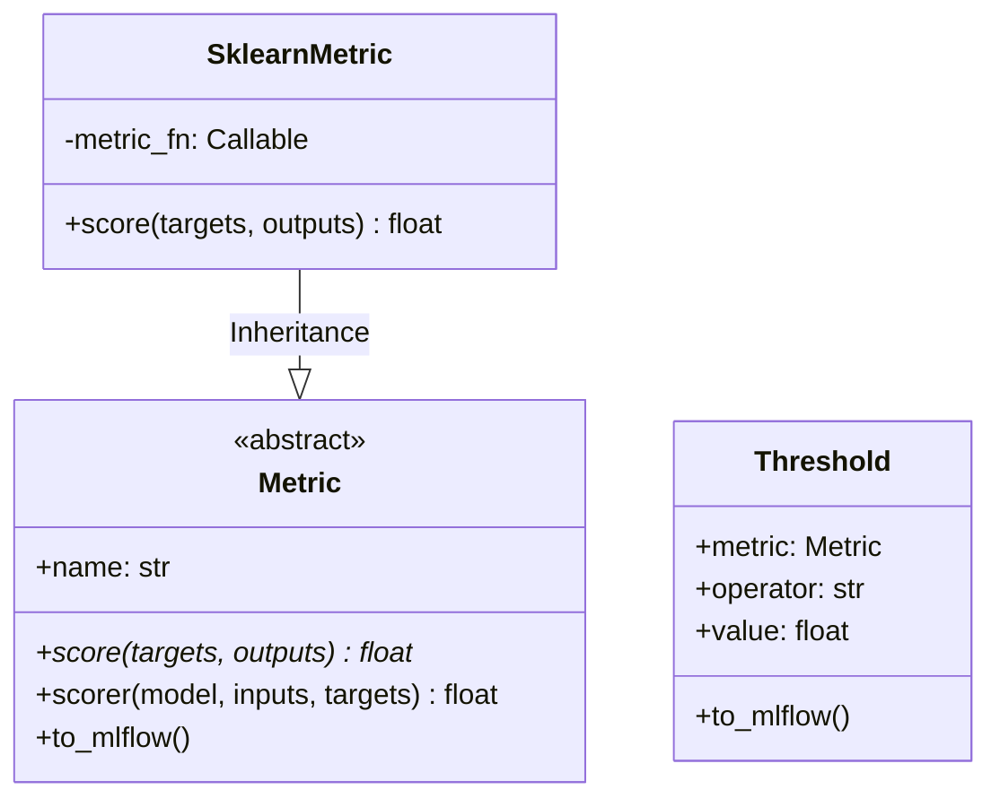

# Module Specification: Metrics & Evaluation Scorers

* **Source File Reference:** `[[src/regression_model_template/core/metrics.py](../../../../src/regression_model_template/core/metrics.py)](../../../../[src/regression_model_template/core/metrics.py](../../../../src/regression_model_template/core/metrics.py))` (Lines: L1-L148)
* **Upstream Dependencies:** `scikit-learn`, `mlflow`
* **Downstream Consumers:** [Modules/RegressionModelTemplate/Jobs/Evaluations](../jobs/evaluations.md), [Modules/RegressionModelTemplate/Jobs/Training](../jobs/training.md), [Modules/RegressionModelTemplate/Jobs/Tuning](../jobs/tuning.md)

## 1. Architectural Role & Responsibilities
`metrics.py` provides uniform metric wrappers for regression evaluation. Supports calculating RMSE, MAE, R2 scores, generating Scikit-Learn custom scorers, and logging evaluation metrics directly to MLflow.

## 2. UML 2.0 Class Diagram

## 3. Class & Method Specifications

### `Metric` (`[[src/regression_model_template/core/metrics.py:L27-L95](../../../../src/regression_model_template/core/metrics.py#L27-L95)](../../../../[src/regression_model_template/core/metrics.py](../../../../src/regression_model_template/core/metrics.py)#L27-L95)`)
* `score(self, targets: np.ndarray, outputs: np.ndarray) -> float` (L44-L53): Abstract method computing metric score.
* `scorer(self, model, inputs, targets) -> float` (L55-L68): Generates Scikit-Learn compatible scoring function.
* `to_mlflow(self)` (L70-L95): Logs metric name and value to active MLflow run.

### `SklearnMetric` (`[[src/regression_model_template/core/metrics.py:L98-L117](../../../../src/regression_model_template/core/metrics.py#L98-L117)](../../../../[src/regression_model_template/core/metrics.py](../../../../src/regression_model_template/core/metrics.py)#L98-L117)`)
* `score(self, targets: np.ndarray, outputs: np.ndarray) -> float` (L111-L117): Wraps Scikit-Learn loss metrics (e.g. `root_mean_squared_error`).

### `Threshold` (`[[src/regression_model_template/core/metrics.py:L126-L148](../../../../src/regression_model_template/core/metrics.py#L126-L148)](../../../../[src/regression_model_template/core/metrics.py](../../../../src/regression_model_template/core/metrics.py)#L126-L148)`)
* `to_mlflow(self)` (L140-L148): Compares metric score against threshold constraint for model promotion gate checks.
