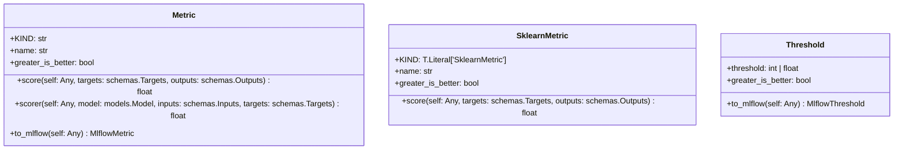

# Module Specification: metrics

* **Source Reference:** [src/regression_model_template/core/metrics.py](../../../src/regression_model_template/core/metrics.py) (Lines: L1-L148)

## 1. Architectural Role & Responsibilities
Evaluate model performances with metrics.

## 2. UML 2.0 Class Diagram

## 3. Class & Method Specifications

### `Metric` ([`src/regression_model_template/core/metrics.py:L27-L95`](../../../src/regression_model_template/core/metrics.py#L27-L95))

Base class for a project metric.

Use metrics to evaluate model performance.
e.g., accuracy, precision, recall, MAE, F1, ...

Parameters:
    name (str): name of the metric for the reporting.
    greater_is_better (bool): maximize or minimize result.

#### Methods

* **`score(self: Any, targets: schemas.Targets, outputs: schemas.Outputs) -> float`** (L44-L53)
  - **Purpose**: Score the outputs against the targets.
  - **Inputs**:
    - `self` (`Any`): Parameter description.
    - `targets` (`schemas.Targets`): Parameter description.
    - `outputs` (`schemas.Outputs`): Parameter description.
  - **Outputs**:
    - `float`: Return value description.

* **`scorer(self: Any, model: models.Model, inputs: schemas.Inputs, targets: schemas.Targets) -> float`** (L55-L68)
  - **Purpose**: Score model outputs against targets.
  - **Inputs**:
    - `self` (`Any`): Parameter description.
    - `model` (`models.Model`): Parameter description.
    - `inputs` (`schemas.Inputs`): Parameter description.
    - `targets` (`schemas.Targets`): Parameter description.
  - **Outputs**:
    - `float`: Return value description.

* **`to_mlflow(self: Any) -> MlflowMetric`** (L70-L95)
  - **Purpose**: Convert the metric to an Mlflow metric.
  - **Inputs**:
    - `self` (`Any`): Parameter description.
  - **Outputs**:
    - `MlflowMetric`: Return value description.

### `SklearnMetric` ([`src/regression_model_template/core/metrics.py:L98-L117`](../../../src/regression_model_template/core/metrics.py#L98-L117))

Compute metrics with sklearn.

Parameters:
    name (str): name of the sklearn metric.
    greater_is_better (bool): maximize or minimize.

#### Methods

* **`score(self: Any, targets: schemas.Targets, outputs: schemas.Outputs) -> float`** (L111-L117)
  - **Purpose**: No description available.
  - **Inputs**:
    - `self` (`Any`): Parameter description.
    - `targets` (`schemas.Targets`): Parameter description.
    - `outputs` (`schemas.Outputs`): Parameter description.
  - **Outputs**:
    - `float`: Return value description.

### `Threshold` ([`src/regression_model_template/core/metrics.py:L126-L148`](../../../src/regression_model_template/core/metrics.py#L126-L148))

A project threshold for a metric.

Use thresholds to monitor model performances.
e.g., to trigger an alert when a threshold is met.

Parameters:
    threshold (int | float): absolute threshold value.
    greater_is_better (bool): maximize or minimize result.

#### Methods

* **`to_mlflow(self: Any) -> MlflowThreshold`** (L140-L148)
  - **Purpose**: Convert the threshold to an mlflow threshold.
  - **Inputs**:
    - `self` (`Any`): Parameter description.
  - **Outputs**:
    - `MlflowThreshold`: Return value description.
