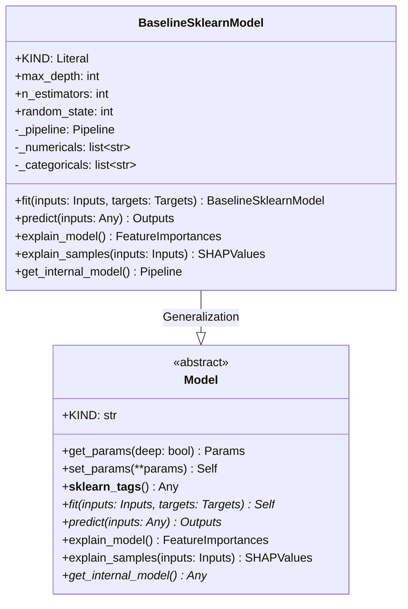
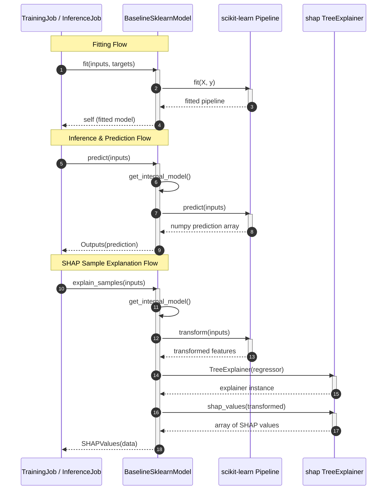

# Module Specification: Model Wrappers

* **Source File Reference:** `[[[[[src/regression_model_template/core/models.py](../../../../src/regression_model_template/core/models.py)](../../../../[src/regression_model_template/core/models.py](../../../../src/regression_model_template/core/models.py))](../../../../[[src/regression_model_template/core/models.py](../../../../src/regression_model_template/core/models.py)](../../../../[src/regression_model_template/core/models.py](../../../../src/regression_model_template/core/models.py)))](../../../../[[[src/regression_model_template/core/models.py](../../../../src/regression_model_template/core/models.py)](../../../../[src/regression_model_template/core/models.py](../../../../src/regression_model_template/core/models.py))](../../../../[[src/regression_model_template/core/models.py](../../../../src/regression_model_template/core/models.py)](../../../../[src/regression_model_template/core/models.py](../../../../src/regression_model_template/core/models.py))))](../../../../[[[[src/regression_model_template/core/models.py](../../../../src/regression_model_template/core/models.py)](../../../../[src/regression_model_template/core/models.py](../../../../src/regression_model_template/core/models.py))](../../../../[[src/regression_model_template/core/models.py](../../../../src/regression_model_template/core/models.py)](../../../../[src/regression_model_template/core/models.py](../../../../src/regression_model_template/core/models.py)))](../../../../[[[src/regression_model_template/core/models.py](../../../../src/regression_model_template/core/models.py)](../../../../[src/regression_model_template/core/models.py](../../../../src/regression_model_template/core/models.py))](../../../../[[src/regression_model_template/core/models.py](../../../../src/regression_model_template/core/models.py)](../../../../[src/regression_model_template/core/models.py](../../../../src/regression_model_template/core/models.py)))))` (Lines: L1-L220)
* **Upstream Dependencies:** `scikit-learn`, `shap`, `pandas`, `numpy`
* **Downstream Consumers:** [Modules/RegressionModelTemplate/Jobs/Training](../jobs/training.md), [Modules/RegressionModelTemplate/Jobs/Inference](../jobs/inference.md), [Modules/RegressionModelTemplate/Jobs/Explanations](../jobs/explanations.md)

## 1. Architectural Role & Responsibilities
`models.py` defines the abstract base `Model` contract and `BaselineSklearnModel` wrapper. Standardizes `fit()`, `predict()`, `explain_model()`, and `explain_samples()` methods across all model architectures.

## 2. UML 2.0 Class Diagram

## 3. Class & Method Specifications

### `Model` (`[[[[[src/regression_model_template/core/models.py:L24-L122](../../../../src/regression_model_template/core/models.py#L24-L122)](../../../../[src/regression_model_template/core/models.py](../../../../src/regression_model_template/core/models.py)#L24-L122)](../../../../[[src/regression_model_template/core/models.py](../../../../src/regression_model_template/core/models.py)](../../../../[src/regression_model_template/core/models.py](../../../../src/regression_model_template/core/models.py))#L24-L122)](../../../../[[[src/regression_model_template/core/models.py](../../../../src/regression_model_template/core/models.py)](../../../../[src/regression_model_template/core/models.py](../../../../src/regression_model_template/core/models.py))](../../../../[[src/regression_model_template/core/models.py](../../../../src/regression_model_template/core/models.py)](../../../../[src/regression_model_template/core/models.py](../../../../src/regression_model_template/core/models.py)))#L24-L122)](../../../../[[[[src/regression_model_template/core/models.py](../../../../src/regression_model_template/core/models.py)](../../../../[src/regression_model_template/core/models.py](../../../../src/regression_model_template/core/models.py))](../../../../[[src/regression_model_template/core/models.py](../../../../src/regression_model_template/core/models.py)](../../../../[src/regression_model_template/core/models.py](../../../../src/regression_model_template/core/models.py)))](../../../../[[[src/regression_model_template/core/models.py](../../../../src/regression_model_template/core/models.py)](../../../../[src/regression_model_template/core/models.py](../../../../src/regression_model_template/core/models.py))](../../../../[[src/regression_model_template/core/models.py](../../../../src/regression_model_template/core/models.py)](../../../../[src/regression_model_template/core/models.py](../../../../src/regression_model_template/core/models.py))))#L24-L122)`)
* `get_params(self, deep=True)` (L33-L46): Returns model hyperparameters dictionary.
* `fit(self, inputs, targets)` (L69-L78): Abstract fitting method.
* `predict(self, inputs)` (L81-L89): Abstract prediction method.
* `explain_model(self)` (L91-L100): Abstract global model explainability method.

### `BaselineSklearnModel` (`[[[[[src/regression_model_template/core/models.py:L125-L220](../../../../src/regression_model_template/core/models.py#L125-L220)](../../../../[src/regression_model_template/core/models.py](../../../../src/regression_model_template/core/models.py)#L125-L220)](../../../../[[src/regression_model_template/core/models.py](../../../../src/regression_model_template/core/models.py)](../../../../[src/regression_model_template/core/models.py](../../../../src/regression_model_template/core/models.py))#L125-L220)](../../../../[[[src/regression_model_template/core/models.py](../../../../src/regression_model_template/core/models.py)](../../../../[src/regression_model_template/core/models.py](../../../../src/regression_model_template/core/models.py))](../../../../[[src/regression_model_template/core/models.py](../../../../src/regression_model_template/core/models.py)](../../../../[src/regression_model_template/core/models.py](../../../../src/regression_model_template/core/models.py)))#L125-L220)](../../../../[[[[src/regression_model_template/core/models.py](../../../../src/regression_model_template/core/models.py)](../../../../[src/regression_model_template/core/models.py](../../../../src/regression_model_template/core/models.py))](../../../../[[src/regression_model_template/core/models.py](../../../../src/regression_model_template/core/models.py)](../../../../[src/regression_model_template/core/models.py](../../../../src/regression_model_template/core/models.py)))](../../../../[[[src/regression_model_template/core/models.py](../../../../src/regression_model_template/core/models.py)](../../../../[src/regression_model_template/core/models.py](../../../../src/regression_model_template/core/models.py))](../../../../[[src/regression_model_template/core/models.py](../../../../src/regression_model_template/core/models.py)](../../../../[src/regression_model_template/core/models.py](../../../../src/regression_model_template/core/models.py))))#L125-L220)`)
* `fit(self, inputs, targets) -> BaselineSklearnModel` (L161-L183): Trains underlying Scikit-Learn Pipeline on feature matrix.
* `predict(self, inputs) -> np.ndarray` (L185-L189): Generates numerical regression predictions.
* `explain_model(self)` (L191-L202): Computes SHAP TreeExplainer/LinearExplainer global feature importances.
* `explain_samples(self, inputs)` (L204-L214): Computes local SHAP explanations for specific sample rows.

## 4. Execution Workflow Sequence Diagram

