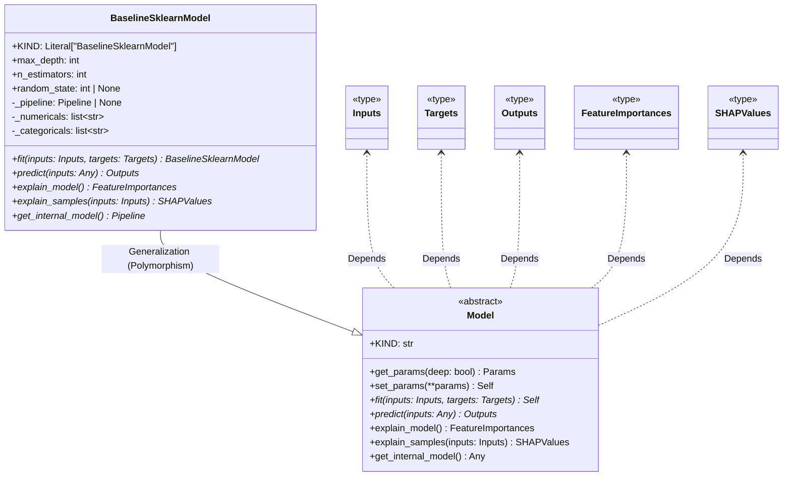

# Module Specification: models

* **Source Reference:** [src/regression_model_template/core/models.py](../../../src/regression_model_template/core/models.py) (Lines: L1-L223)

## 1. Architectural Role & Responsibilities
Define trainable machine learning models.

## 2. UML 2.0 Class Diagram

## 3. Class & Method Specifications

### `Model` ([`src/regression_model_template/core/models.py:L24-L122`](../../../src/regression_model_template/core/models.py#L24-L122))

Base class for a project model.

Use a model to adapt AI/ML frameworks.
e.g., to swap easily one model with another.

#### Methods

* **`get_params(self: Any, deep: bool) -> Params`** (L33-L46)
  - **Purpose**: Get the model params.
  - **Inputs**:
    - `self` (`Any`): Parameter description.
    - `deep` (`bool`): Parameter description.
  - **Outputs**:
    - `Params`: Return value description.

* **`set_params(self: Any) -> T.Self`** (L48-L56)
  - **Purpose**: Set the model params in place.
  - **Inputs**:
    - `self` (`Any`): Parameter description.
  - **Outputs**:
    - `T.Self`: Return value description.

* **`__sklearn_tags__(self: Any) -> T.Any`** (L58-L66)
  - **Purpose**: Get the model tags for scikit-learn.
  - **Inputs**:
    - `self` (`Any`): Parameter description.
  - **Outputs**:
    - `T.Any`: Return value description.

* **`fit(self: Any, inputs: schemas.Inputs, targets: schemas.Targets) -> T.Self`** (L69-L78)
  - **Purpose**: Fit the model on the given inputs and targets.
  - **Inputs**:
    - `self` (`Any`): Parameter description.
    - `inputs` (`schemas.Inputs`): Parameter description.
    - `targets` (`schemas.Targets`): Parameter description.
  - **Outputs**:
    - `T.Self`: Return value description.

* **`predict(self: Any, inputs: T.Any) -> schemas.Outputs`** (L81-L89)
  - **Purpose**: Generate outputs with the model for the given inputs.
  - **Inputs**:
    - `self` (`Any`): Parameter description.
    - `inputs` (`T.Any`): Parameter description.
  - **Outputs**:
    - `schemas.Outputs`: Return value description.

* **`explain_model(self: Any) -> schemas.FeatureImportances`** (L91-L100)
  - **Purpose**: Explain the internal model structure.
  - **Inputs**:
    - `self` (`Any`): Parameter description.
  - **Outputs**:
    - `schemas.FeatureImportances`: Return value description.

* **`explain_samples(self: Any, inputs: schemas.Inputs) -> schemas.SHAPValues`** (L102-L111)
  - **Purpose**: Explain model outputs on input samples.
  - **Inputs**:
    - `self` (`Any`): Parameter description.
    - `inputs` (`schemas.Inputs`): Parameter description.
  - **Outputs**:
    - `schemas.SHAPValues`: Return value description.

* **`get_internal_model(self: Any) -> T.Any`** (L113-L122)
  - **Purpose**: Return the internal model in the object.
  - **Inputs**:
    - `self` (`Any`): Parameter description.
  - **Outputs**:
    - `T.Any`: Return value description.

### `BaselineSklearnModel` ([`src/regression_model_template/core/models.py:L125-L220`](../../../src/regression_model_template/core/models.py#L125-L220))

Simple baseline model based on scikit-learn.

Parameters:
    max_depth (int): maximum depth of the random forest.
    n_estimators (int): number of estimators in the random forest.
    random_state (int, optional): random state of the machine learning pipeline.

#### Methods

* **`fit(self: Any, inputs: schemas.Inputs, targets: schemas.Targets) -> 'BaselineSklearnModel'`** (L161-L183)
  - **Purpose**: No description available.
  - **Inputs**:
    - `self` (`Any`): Parameter description.
    - `inputs` (`schemas.Inputs`): Parameter description.
    - `targets` (`schemas.Targets`): Parameter description.
  - **Outputs**:
    - `'BaselineSklearnModel'`: Return value description.

* **`predict(self: Any, inputs: T.Any) -> schemas.Outputs`** (L185-L189)
  - **Purpose**: No description available.
  - **Inputs**:
    - `self` (`Any`): Parameter description.
    - `inputs` (`T.Any`): Parameter description.
  - **Outputs**:
    - `schemas.Outputs`: Return value description.

* **`explain_model(self: Any) -> schemas.FeatureImportances`** (L191-L202)
  - **Purpose**: No description available.
  - **Inputs**:
    - `self` (`Any`): Parameter description.
  - **Outputs**:
    - `schemas.FeatureImportances`: Return value description.

* **`explain_samples(self: Any, inputs: schemas.Inputs) -> schemas.SHAPValues`** (L204-L214)
  - **Purpose**: No description available.
  - **Inputs**:
    - `self` (`Any`): Parameter description.
    - `inputs` (`schemas.Inputs`): Parameter description.
  - **Outputs**:
    - `schemas.SHAPValues`: Return value description.

* **`get_internal_model(self: Any) -> pipeline.Pipeline`** (L216-L220)
  - **Purpose**: No description available.
  - **Inputs**:
    - `self` (`Any`): Parameter description.
  - **Outputs**:
    - `pipeline.Pipeline`: Return value description.
