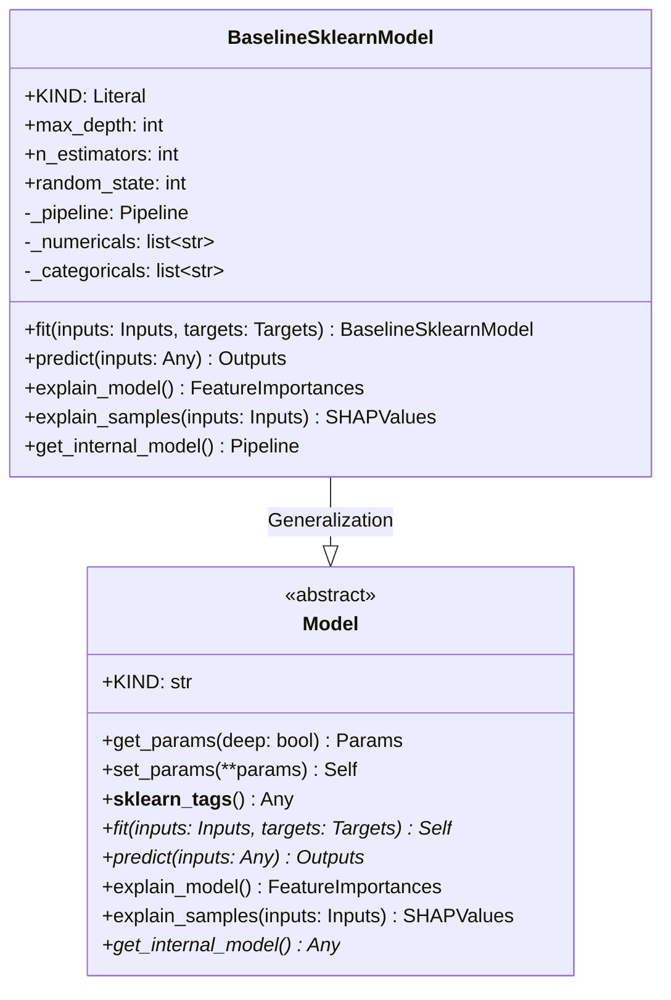
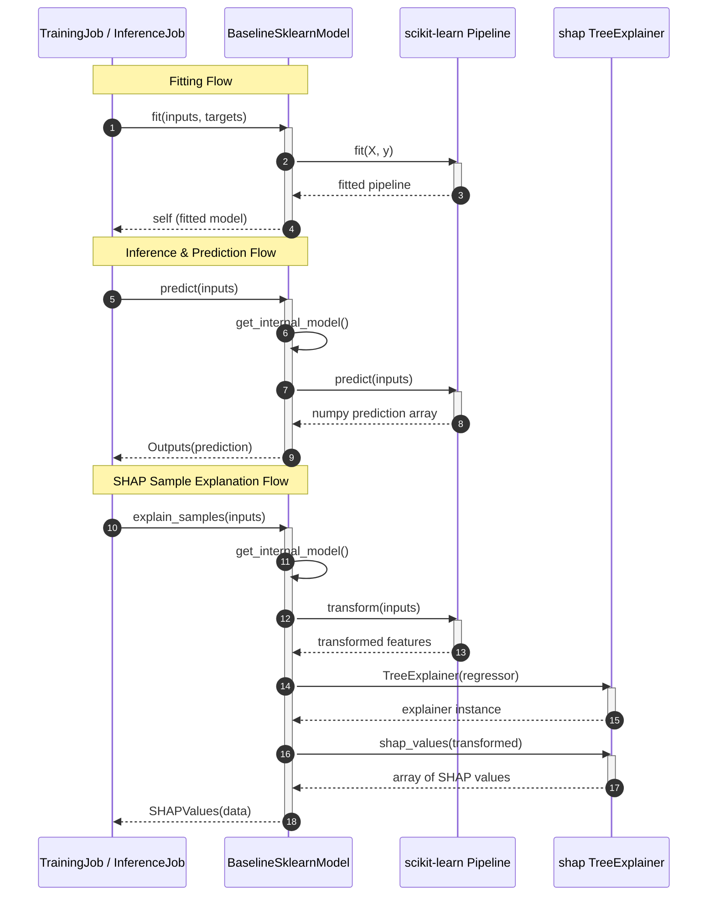

# Module Specification: Model Wrappers

* **Source File Reference:** [`src/regression_model_template/core/models.py`](/src/regression_model_template/core/models.py) (Lines: L1-L220)
* **Upstream Dependencies:** `scikit-learn`, `shap`, `pandas`, `numpy`
* **Downstream Consumers:** [Modules/RegressionModelTemplate/Jobs/Training](../jobs/training.md), [Modules/RegressionModelTemplate/Jobs/Inference](../jobs/inference.md), [Modules/RegressionModelTemplate/Jobs/Explanations](../jobs/explanations.md)

## 1. Architectural Role & Responsibilities
`models.py` defines the abstract base `Model` contract and `BaselineSklearnModel` wrapper. Standardizes `fit()`, `predict()`, `explain_model()`, and `explain_samples()` methods across all model architectures.

## 2. UML 2.0 Class Diagram

## 3. Class & Method Specifications

### `Model` ([`src/regression_model_template/core/models.py:L24-L122`](/src/regression_model_template/core/models.py#L24-L122))

The `Model` class is an abstract base class that defines the core machine learning interface and configuration contract for all models in the repository. It inherits from `abc.ABC` for abstract method enforcement and `pydantic.BaseModel` to handle strict validation, serialization, and immutability (`frozen=True`, `strict=True`, `extra="forbid"`).

#### Methods

* **`get_params(self, deep: bool = True) -> Params`** (L33-L46)
  - **Purpose**: Retrieves the hyperparameters and configuration parameters of the model wrapper, formatted as a dictionary.
  - **Inputs**:
    - `deep` (`bool`, default `True`): If `True`, returns parameters for this wrapper and any nested sub-estimators (compatibility with standard Scikit-Learn parameter inspection).
  - **Outputs**:
    - `Params` (`dict[str, Any]`): A dictionary containing model parameter keys mapped to their current values.

* **`set_params(self, **params) -> T.Self`** (L48-L57)
  - **Purpose**: Dynamically updates the model parameters. Because the model is defined as a frozen Pydantic model, this method returns a new validated instance of the model with the updated parameters.
  - **Inputs**:
    - `**params`: Arbitrary keyword arguments representing parameter names and their target new values.
  - **Outputs**:
    - `Self` (`Model`): A new instance of the model with the updated parameter set.

* **`__sklearn_tags__(self) -> T.Any`** (L59-L67)
  - **Purpose**: Returns Scikit-Learn compatible estimator tags. This allows custom model wrappers to seamlessly integrate into Scikit-Learn pipelines, grids, and cross-validators.
  - **Inputs**: None.
  - **Outputs**:
    - `Any` (`dict`): Scikit-Learn metadata tags defining estimator capabilities.

* **`fit(self, inputs: schemas.Inputs, targets: schemas.Targets) -> T.Self`** (L69-L78)
  - **Purpose**: Abstract training method. Must be implemented by concrete classes to train the model on provided input features and target values.
  - **Inputs**:
    - `inputs` (`schemas.Inputs` / `pandas.DataFrame`): The input features matching `InputsSchema`.
    - `targets` (`schemas.Targets` / `pandas.DataFrame`): The corresponding training target variables matching `TargetsSchema`.
  - **Outputs**:
    - `Self` (`Model`): The trained model instance.

* **`predict(self, inputs: T.Any) -> schemas.Outputs`** (L81-L89)
  - **Purpose**: Abstract prediction method. Concrete classes must implement this to perform inference and output regression predictions.
  - **Inputs**:
    - `inputs` (`Any` / `pandas.DataFrame`): Input feature matrix.
  - **Outputs**:
    - `schemas.Outputs` (`pandas.DataFrame`): Prediction results matching `OutputsSchema` (containing the predicted values under the `prediction` column).

* **`explain_model(self) -> schemas.FeatureImportances`** (L91-L100)
  - **Purpose**: Abstract method for global model explainability. Computes global feature importances for all input variables.
  - **Inputs**: None.
  - **Outputs**:
    - `schemas.FeatureImportances` (`pandas.DataFrame`): Global feature importances matching `FeatureImportancesSchema`.

* **`explain_samples(self, inputs: schemas.Inputs) -> schemas.SHAPValues`** (L102-L111)
  - **Purpose**: Abstract method for local/sample-level explainability. Generates attribution metrics (e.g. SHAP values) indicating how each feature influenced the prediction for individual input rows.
  - **Inputs**:
    - `inputs` (`schemas.Inputs` / `pandas.DataFrame`): Feature matrix containing sample rows to explain.
  - **Outputs**:
    - `schemas.SHAPValues` (`pandas.DataFrame`): Matrix of attribution values matching `SHAPValuesSchema`.

* **`get_internal_model(self) -> T.Any`** (L113-L122)
  - **Purpose**: Abstract getter to retrieve the raw underlying model engine (e.g., the Scikit-Learn `Pipeline` or estimator object).
  - **Inputs**: None.
  - **Outputs**:
    - `Any`: The raw wrapped machine learning pipeline or model instance.

---

### `BaselineSklearnModel` ([`src/regression_model_template/core/models.py:L125-L220`](/src/regression_model_template/core/models.py#L125-L220))

The `BaselineSklearnModel` class is a concrete implementation of `Model` wrapping a Scikit-Learn pipeline. It uses a `ColumnTransformer` to perform One-Hot Encoding on categorical features (`season`, `weathersit`), passes through numerical variables, and trains a `RandomForestRegressor` model.

#### Methods

* **`fit(self, inputs: schemas.Inputs, targets: schemas.Targets) -> BaselineSklearnModel`** (L161-L183)
  - **Purpose**: Instantiates and trains the underlying Scikit-Learn preprocessing and random forest regression pipeline. Categorical inputs are one-hot encoded, numerical features are passed through, and the resulting feature matrix is used to train the random forest regressor.
  - **Inputs**:
    - `inputs` (`schemas.Inputs` / `pandas.DataFrame`): Input training feature matrix.
    - `targets` (`schemas.Targets` / `pandas.DataFrame`): Ground truth target labels dataframe.
  - **Outputs**:
    - `self` (`BaselineSklearnModel`): The trained baseline model instance with the internal pipeline fully fitted and cached.

* **`predict(self, inputs: T.Any) -> schemas.Outputs`** (L185-L189)
  - **Purpose**: Evaluates model predictions on new input features using the fitted pipeline.
  - **Inputs**:
    - `inputs` (`Any` / `pandas.DataFrame`): Feature matrix containing new samples.
  - **Outputs**:
    - `schemas.Outputs` (`pandas.DataFrame`): A Pandas DataFrame containing target predictions under the `prediction` column.

* **`explain_model(self) -> schemas.FeatureImportances`** (L191-L202)
  - **Purpose**: Computes global feature importances by extracting random forest tree importances and mapping them to their corresponding column names output by the preprocessor's `ColumnTransformer`.
  - **Inputs**: None.
  - **Outputs**:
    - `schemas.FeatureImportances` (`pandas.DataFrame`): Pandas DataFrame listing each feature and its computed importance weight.

* **`explain_samples(self, inputs: schemas.Inputs) -> schemas.SHAPValues`** (L204-L214)
  - **Purpose**: Explains individual sample predictions by preprocessing the input features, initializing a `shap.TreeExplainer` on the random forest model, and returning sample-level feature attribution values.
  - **Inputs**:
    - `inputs` (`schemas.Inputs` / `pandas.DataFrame`): Feature dataframe of samples to explain.
  - **Outputs**:
    - `schemas.SHAPValues` (`pandas.DataFrame`): Pandas DataFrame representing local feature attributions for each input sample row.

* **`get_internal_model(self) -> pipeline.Pipeline`** (L216-L220)
  - **Purpose**: Retrieves the wrapped Scikit-Learn `Pipeline`. Throws an error if the model has not been trained yet.
  - **Inputs**: None.
  - **Outputs**:
    - `Pipeline` (`sklearn.pipeline.Pipeline`): The underlying fitted pipeline object.
  - **Raises**:
    - `ValueError`: If the model has not yet been fitted (`fit` has not been called).

## 4. Execution Workflow Sequence Diagram

