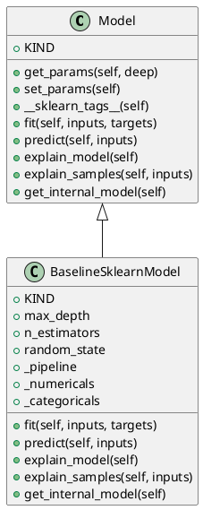

<!-- AUTOGENERATED_START -->
# src/regression_model_template/core/models.py

## Module Overview
Define trainable machine learning models.

## Dependencies
- `abc`
- `typing`
- `pydantic`
- `shap`
- `sklearn`
- `regression_model_template.core`

## Public API
## Classes
### Class `Model`
Base class for a project model.

Use a model to adapt AI/ML frameworks.
e.g., to swap easily one model with another.
- **Bases:** None

#### Attributes
- `KIND`

#### Methods
##### `get_params`
Get the model params.

Args:
    deep (bool, optional): ignored.

Returns:
    Params: internal model parameters.
- **Arguments:** self, deep
- **Returns:** Params

##### `set_params`
Set the model params in place.

Returns:
    T.Self: instance of the model.
- **Arguments:** self
- **Returns:** T.Self

##### `__sklearn_tags__`
Get the model tags for scikit-learn.

Returns:
    T.Any: model tags.
- **Arguments:** self
- **Returns:** T.Any

##### `fit`
Fit the model on the given inputs and targets.

Args:
    inputs (schemas.Inputs): model training inputs.
    targets (schemas.Targets): model training targets.

Returns:
    T.Self: instance of the model.
- **Arguments:** self, inputs, targets
- **Returns:** T.Self

##### `predict`
Generate outputs with the model for the given inputs.

Args:
    inputs (schemas.Inputs): model prediction inputs.

Returns:
    schemas.Outputs: model prediction outputs.
- **Arguments:** self, inputs
- **Returns:** schemas.Outputs

##### `explain_model`
Explain the internal model structure.

Raises:
    NotImplementedError: method not implemented.

Returns:
    schemas.FeatureImportances: feature importances.
- **Arguments:** self
- **Returns:** schemas.FeatureImportances

##### `explain_samples`
Explain model outputs on input samples.

Raises:
    NotImplementedError: method not implemented.

Returns:
    schemas.SHAPValues: SHAP values.
- **Arguments:** self, inputs
- **Returns:** schemas.SHAPValues

##### `get_internal_model`
Return the internal model in the object.

Raises:
    NotImplementedError: method not implemented.

Returns:
    T.Any: any internal model (either empty or fitted).
- **Arguments:** self
- **Returns:** T.Any

### Class `BaselineSklearnModel`
Simple baseline model based on scikit-learn.

Parameters:
    max_depth (int): maximum depth of the random forest.
    n_estimators (int): number of estimators in the random forest.
    random_state (int, optional): random state of the machine learning pipeline.
- **Bases:** Model

#### Attributes
- `KIND`
- `max_depth`
- `n_estimators`
- `random_state`
- `_pipeline`
- `_numericals`
- `_categoricals`

#### Methods
##### `fit`
- **Arguments:** self, inputs, targets
- **Returns:** 'BaselineSklearnModel'

##### `predict`
- **Arguments:** self, inputs
- **Returns:** schemas.Outputs

##### `explain_model`
- **Arguments:** self
- **Returns:** schemas.FeatureImportances

##### `explain_samples`
- **Arguments:** self, inputs
- **Returns:** schemas.SHAPValues

##### `get_internal_model`
- **Arguments:** self
- **Returns:** pipeline.Pipeline

## UML

<!-- AUTOGENERATED_END -->
