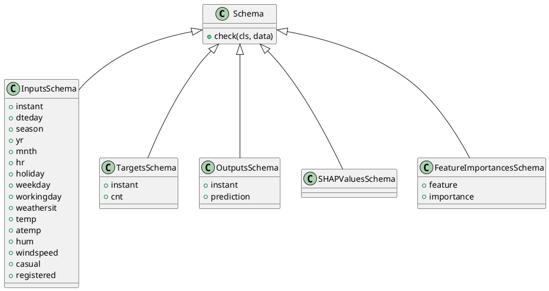

<!-- AUTOGENERATED_START -->
# src/regression_model_template/core/schemas.py

## Module Overview
Define and validate dataframe schemas.

## Dependencies
- `typing`
- `pandas`
- `pandera`
- `pandera.typing`
- `pandera.typing.common`

## Public API
## Classes
### Class `Schema`
Base class for a dataframe schema.

Use a schema to type your dataframe object.
e.g., to communicate and validate its fields.
- **Bases:** None

#### Attributes
None

#### Methods
##### `check`
Check the dataframe with this schema.

Args:
    data (pd.DataFrame): dataframe to check.

Returns:
    papd.DataFrame[TSchema]: validated dataframe.
- **Arguments:** cls, data
- **Returns:** papd.DataFrame[TSchema]

### Class `InputsSchema`
Schema for the project inputs.
- **Bases:** Schema

#### Attributes
- `instant`
- `dteday`
- `season`
- `yr`
- `mnth`
- `hr`
- `holiday`
- `weekday`
- `workingday`
- `weathersit`
- `temp`
- `atemp`
- `hum`
- `windspeed`
- `casual`
- `registered`

#### Methods
### Class `TargetsSchema`
Schema for the project target.
- **Bases:** Schema

#### Attributes
- `instant`
- `cnt`

#### Methods
### Class `OutputsSchema`
Schema for the project output.
- **Bases:** Schema

#### Attributes
- `instant`
- `prediction`

#### Methods
### Class `SHAPValuesSchema`
Schema for the project shap values.
- **Bases:** Schema

#### Attributes
None

#### Methods
### Class `FeatureImportancesSchema`
Schema for the project feature importances.
- **Bases:** Schema

#### Attributes
- `feature`
- `importance`

#### Methods
## UML

<!-- AUTOGENERATED_END -->
