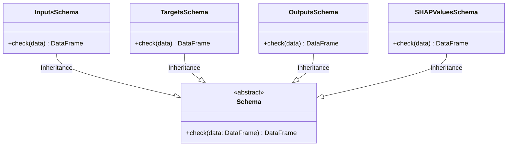

# Module Specification: Data Validation Schemas

* **Source File Reference:** `[[src/regression_model_template/core/schemas.py](../../../../src/regression_model_template/core/schemas.py)](../../../../[src/regression_model_template/core/schemas.py](../../../../src/regression_model_template/core/schemas.py))` (Lines: L1-L117)
* **Upstream Dependencies:** `pandera`, `pydantic`
* **Downstream Consumers:** [Modules/RegressionModelTemplate/Jobs/Training](../jobs/training.md), [Modules/RegressionModelTemplate/Controller/KafkaApp](../controller/kafka_app.md)

## 1. Architectural Role & Responsibilities
`schemas.py` defines Pandera DataFrame schemas (`InputsSchema`, `TargetsSchema`, `OutputsSchema`, `SHAPValuesSchema`) to enforce strict type checking, non-null constraints, and numeric range limits across pipeline operations.

## 2. UML 2.0 Class Diagram

## 3. Class & Method Specifications

### `Schema` (`[[src/regression_model_template/core/schemas.py:L20-L48](../../../../src/regression_model_template/core/schemas.py#L20-L48)](../../../../[src/regression_model_template/core/schemas.py](../../../../src/regression_model_template/core/schemas.py)#L20-L48)`)
* `check(cls, data: pd.DataFrame) -> pd.DataFrame` (L39-L48): Class method executing Pandera schema validation on input DataFrame.

### Concrete Schema Implementations
* `InputsSchema` (L51-L69): Validates raw input features (numeric dtypes, min/max ranges).
* `TargetsSchema` (L75-L79): Validates target ground truth values.
* `OutputsSchema` (L85-L89): Validates prediction outputs.
* `SHAPValuesSchema` (L95-L107): Validates SHAP value matrices.
