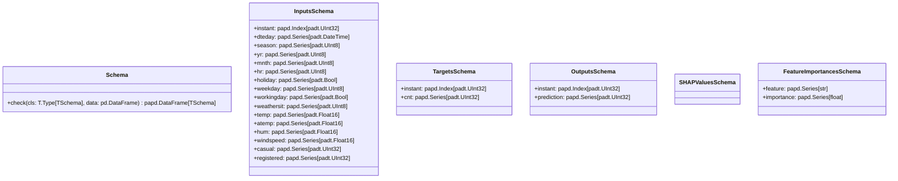

# Module Specification: schemas

* **Source Reference:** [src/regression_model_template/core/schemas.py](../../../src/regression_model_template/core/schemas.py) (Lines: L1-L120)

## 1. Architectural Role & Responsibilities
Define and validate dataframe schemas.

## 2. UML 2.0 Class Diagram

## 3. Class & Method Specifications

### `Schema` ([`src/regression_model_template/core/schemas.py:L20-L48`](../../../src/regression_model_template/core/schemas.py#L20-L48))

Base class for a dataframe schema.

Use a schema to type your dataframe object.
e.g., to communicate and validate its fields.

#### Methods

* **`check(cls: T.Type[TSchema], data: pd.DataFrame) -> papd.DataFrame[TSchema]`** (L39-L48)
  - **Purpose**: Check the dataframe with this schema.
  - **Inputs**:
    - `cls` (`T.Type[TSchema]`): Parameter description.
    - `data` (`pd.DataFrame`): Parameter description.
  - **Outputs**:
    - `papd.DataFrame[TSchema]`: Return value description.

### `InputsSchema` ([`src/regression_model_template/core/schemas.py:L51-L69`](../../../src/regression_model_template/core/schemas.py#L51-L69))

Schema for the project inputs.

#### Methods

*No methods defined.*

### `TargetsSchema` ([`src/regression_model_template/core/schemas.py:L75-L79`](../../../src/regression_model_template/core/schemas.py#L75-L79))

Schema for the project target.

#### Methods

*No methods defined.*

### `OutputsSchema` ([`src/regression_model_template/core/schemas.py:L85-L89`](../../../src/regression_model_template/core/schemas.py#L85-L89))

Schema for the project output.

#### Methods

*No methods defined.*

### `SHAPValuesSchema` ([`src/regression_model_template/core/schemas.py:L95-L107`](../../../src/regression_model_template/core/schemas.py#L95-L107))

Schema for the project shap values.

#### Methods

*No methods defined.*

### `FeatureImportancesSchema` ([`src/regression_model_template/core/schemas.py:L113-L117`](../../../src/regression_model_template/core/schemas.py#L113-L117))

Schema for the project feature importances.

#### Methods

*No methods defined.*
