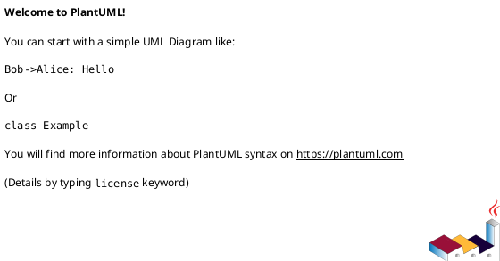

<!-- AUTOGENERATED_START -->
# src/regression_model_template/init_data.py

## Module Overview
Script to initialize synthetic train and test parquet datasets.

## Dependencies
- `argparse`
- `os`
- `numpy`
- `pandas`
- `regression_model_template.core.schemas`

## Public API
### Function `generate_data`
Generate synthetic regression data and validate schemas.
- **Arguments:** output_dir
- **Returns:** None

### Function `main`
CLI entry point for data initialization.
- **Arguments:**
- **Returns:** None

## Classes
## UML

<!-- AUTOGENERATED_END -->
