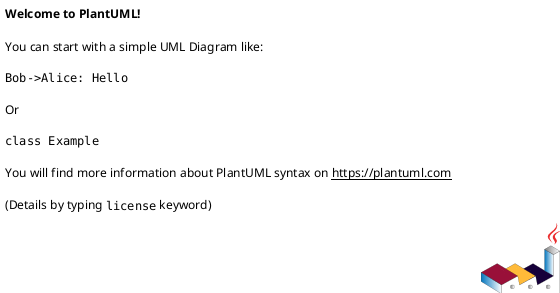

<!-- AUTOGENERATED_START -->
# src/regression_model_template/io/__init__.py

## Module Overview
Components related to external operations.

## Dependencies
None

## Public API
## Classes
## UML

<!-- AUTOGENERATED_END -->
