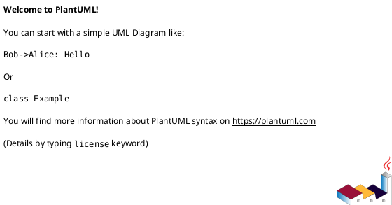

<!-- AUTOGENERATED_START -->
# src/regression_model_template/io/configs.py

## Module Overview
Parse, merge, and convert config objects.

## Dependencies
- `typing`
- `omegaconf`

## Public API
### Function `parse_file`
Parse a config file from a path.

Args:
    path (str): path to local config.

Returns:
    Config: representation of the config file.
- **Arguments:** path
- **Returns:** Config

### Function `parse_string`
Parse the given config string.

Args:
    string (str): content of config string.

Returns:
    Config: representation of the config string.
- **Arguments:** string
- **Returns:** Config

### Function `merge_configs`
Merge a list of config into a single config.

Args:
    configs (T.Sequence[Config]): list of configs.

Returns:
    Config: representation of the merged config objects.
- **Arguments:** configs
- **Returns:** Config

### Function `to_object`
Convert a config object to a python object.

Args:
    config (Config): representation of the config.
    resolve (bool): resolve variables. Defaults to True.

Returns:
    object: conversion of the config to a python object.
- **Arguments:** config, resolve
- **Returns:** object

## Classes
## UML

<!-- AUTOGENERATED_END -->
