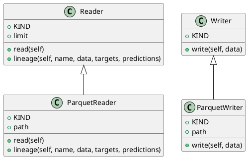

<!-- AUTOGENERATED_START -->
# src/regression_model_template/io/datasets.py

## Module Overview
Read/Write datasets from/to external sources/destinations.

## Dependencies
- `abc`
- `typing`
- `mlflow.data.pandas_dataset`
- `pandas`
- `pydantic`

## Public API
## Classes
### Class `Reader`
Base class for a dataset reader.

Use a reader to load a dataset in memory.
e.g., to read file, database, cloud storage, ...

Parameters:
    limit (int, optional): maximum number of rows to read. Defaults to None.
- **Bases:** None

#### Attributes
- `KIND`
- `limit`

#### Methods
##### `read`
Read a dataframe from a dataset.

Returns:
    pd.DataFrame: dataframe representation.
- **Arguments:** self
- **Returns:** pd.DataFrame

##### `lineage`
Generate lineage information.

Args:
    name (str): dataset name.
    data (pd.DataFrame): reader dataframe.
    targets (str | None): name of the target column.
    predictions (str | None): name of the prediction column.

Returns:
    Lineage: lineage information.
- **Arguments:** self, name, data, targets, predictions
- **Returns:** Lineage

### Class `ParquetReader`
Read a dataframe from a parquet file.

Parameters:
    path (str): local path to the dataset.
- **Bases:** Reader

#### Attributes
- `KIND`
- `path`

#### Methods
##### `read`
- **Arguments:** self
- **Returns:** pd.DataFrame

##### `lineage`
- **Arguments:** self, name, data, targets, predictions
- **Returns:** Lineage

### Class `Writer`
Base class for a dataset writer.

Use a writer to save a dataset from memory.
e.g., to write file, database, cloud storage, ...
- **Bases:** None

#### Attributes
- `KIND`

#### Methods
##### `write`
Write a dataframe to a dataset.

Args:
    data (pd.DataFrame): dataframe representation.
- **Arguments:** self, data
- **Returns:** None

### Class `ParquetWriter`
Writer a dataframe to a parquet file.

Parameters:
    path (str): local or S3 path to the dataset.
- **Bases:** Writer

#### Attributes
- `KIND`
- `path`

#### Methods
##### `write`
- **Arguments:** self, data
- **Returns:** None

## UML

<!-- AUTOGENERATED_END -->
