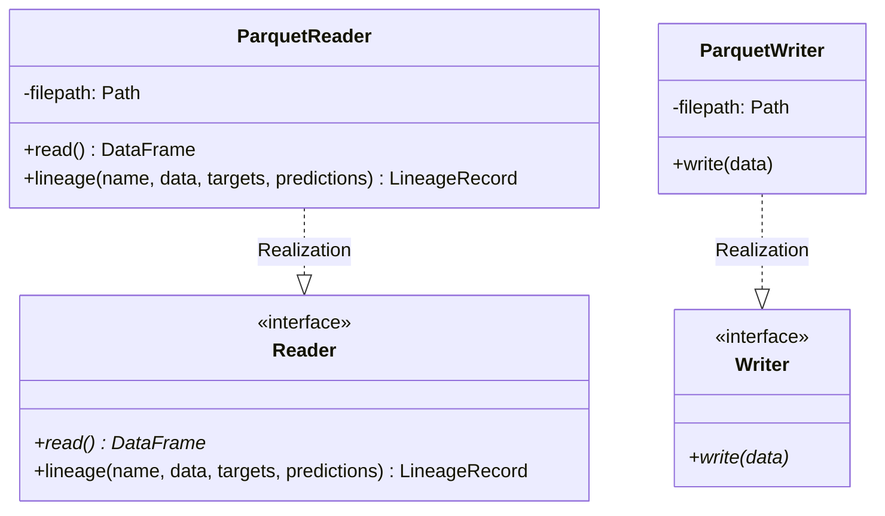

# Module Specification: Dataset Readers & Writers

* **Source File Reference:** `src/regression_model_template/io/datasets.py` (Lines: L1-L125)
* **Upstream Dependencies:** `pyarrow`, `pandas`
* **Downstream Consumers:** [[Modules/RegressionModelTemplate/Jobs/Training]], [[Modules/RegressionModelTemplate/Jobs/Evaluations]], [[Modules/RegressionModelTemplate/Jobs/Inference]]

## 1. Architectural Role & Responsibilities
`datasets.py` defines `Reader` and `Writer` abstractions for dataset ingestion and persistence. Implements `ParquetReader` and `ParquetWriter` with automated lineage tracking hashing data splits.

## 2. UML 2.0 Class Diagram

## 3. Class & Method Specifications

### `Reader` (`src/regression_model_template/io/datasets.py:L19-L59`)
* `read(self) -> pd.DataFrame` (L34-L39): Reads dataset into pandas DataFrame.
* `lineage(self, name, data, targets, predictions)` (L42-L59): Generates dataset hash lineage record for MLflow tracking.

### `ParquetReader` (`src/regression_model_template/io/datasets.py:L62-L87`)
* `read(self) -> pd.DataFrame` (L73-L78): Loads Parquet file using PyArrow backend.

### `ParquetWriter` (`src/regression_model_template/io/datasets.py:L113-L125`)
* `write(self, data: pd.DataFrame)` (L124-L125): Writes pandas DataFrame to disk in Parquet format.
