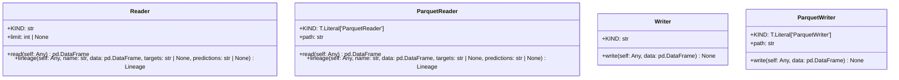

# Module Specification: datasets

* **Source Reference:** [src/regression_model_template/io/datasets.py](../../../src/regression_model_template/io/datasets.py) (Lines: L1-L128)

## 1. Architectural Role & Responsibilities
Read/Write datasets from/to external sources/destinations.

## 2. UML 2.0 Class Diagram

## 3. Class & Method Specifications

### `Reader` ([`src/regression_model_template/io/datasets.py:L19-L59`](../../../src/regression_model_template/io/datasets.py#L19-L59))

Base class for a dataset reader.

Use a reader to load a dataset in memory.
e.g., to read file, database, cloud storage, ...

Parameters:
    limit (int, optional): maximum number of rows to read. Defaults to None.

#### Methods

* **`read(self: Any) -> pd.DataFrame`** (L34-L39)
  - **Purpose**: Read a dataframe from a dataset.
  - **Inputs**:
    - `self` (`Any`): Parameter description.
  - **Outputs**:
    - `pd.DataFrame`: Return value description.

* **`lineage(self: Any, name: str, data: pd.DataFrame, targets: str | None, predictions: str | None) -> Lineage`** (L42-L59)
  - **Purpose**: Generate lineage information.
  - **Inputs**:
    - `self` (`Any`): Parameter description.
    - `name` (`str`): Parameter description.
    - `data` (`pd.DataFrame`): Parameter description.
    - `targets` (`str | None`): Parameter description.
    - `predictions` (`str | None`): Parameter description.
  - **Outputs**:
    - `Lineage`: Return value description.

### `ParquetReader` ([`src/regression_model_template/io/datasets.py:L62-L87`](../../../src/regression_model_template/io/datasets.py#L62-L87))

Read a dataframe from a parquet file.

Parameters:
    path (str): local path to the dataset.

#### Methods

* **`read(self: Any) -> pd.DataFrame`** (L73-L78)
  - **Purpose**: No description available.
  - **Inputs**:
    - `self` (`Any`): Parameter description.
  - **Outputs**:
    - `pd.DataFrame`: Return value description.

* **`lineage(self: Any, name: str, data: pd.DataFrame, targets: str | None, predictions: str | None) -> Lineage`** (L80-L87)
  - **Purpose**: No description available.
  - **Inputs**:
    - `self` (`Any`): Parameter description.
    - `name` (`str`): Parameter description.
    - `data` (`pd.DataFrame`): Parameter description.
    - `targets` (`str | None`): Parameter description.
    - `predictions` (`str | None`): Parameter description.
  - **Outputs**:
    - `Lineage`: Return value description.

### `Writer` ([`src/regression_model_template/io/datasets.py:L95-L110`](../../../src/regression_model_template/io/datasets.py#L95-L110))

Base class for a dataset writer.

Use a writer to save a dataset from memory.
e.g., to write file, database, cloud storage, ...

#### Methods

* **`write(self: Any, data: pd.DataFrame) -> None`** (L105-L110)
  - **Purpose**: Write a dataframe to a dataset.
  - **Inputs**:
    - `self` (`Any`): Parameter description.
    - `data` (`pd.DataFrame`): Parameter description.
  - **Outputs**:
    - `None`: Return value description.

### `ParquetWriter` ([`src/regression_model_template/io/datasets.py:L113-L125`](../../../src/regression_model_template/io/datasets.py#L113-L125))

Writer a dataframe to a parquet file.

Parameters:
    path (str): local or S3 path to the dataset.

#### Methods

* **`write(self: Any, data: pd.DataFrame) -> None`** (L124-L125)
  - **Purpose**: No description available.
  - **Inputs**:
    - `self` (`Any`): Parameter description.
    - `data` (`pd.DataFrame`): Parameter description.
  - **Outputs**:
    - `None`: Return value description.
