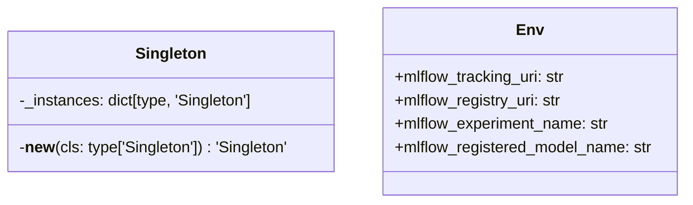

# Module Specification: osvariables

* **Source Reference:** [src/regression_model_template/io/osvariables.py](../../../src/regression_model_template/io/osvariables.py) (Lines: L1-L26)

## 1. Architectural Role & Responsibilities
Documentation for regression_model_template.io.osvariables

## 2. UML 2.0 Class Diagram

## 3. Class & Method Specifications

### `Singleton` ([`src/regression_model_template/io/osvariables.py:L6-L13`](../../../src/regression_model_template/io/osvariables.py#L6-L13))

No description available.

#### Methods

* **`__new__(cls: type['Singleton']) -> 'Singleton'`** (L10-L13)
  - **Purpose**: No description available.
  - **Inputs**:
    - `cls` (`type['Singleton']`): Parameter description.
  - **Outputs**:
    - `'Singleton'`: Return value description.

### `Env` ([`src/regression_model_template/io/osvariables.py:L16-L26`](../../../src/regression_model_template/io/osvariables.py#L16-L26))

No description available.

#### Methods

*No methods defined.*
