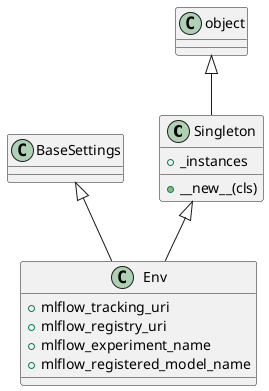

<!-- AUTOGENERATED_START -->
# src/regression_model_template/io/osvariables.py

## Dependencies
- `typing`
- `pydantic_settings`

## Public API
## Classes
### Class `Singleton`
- **Bases:** object

#### Attributes
- `_instances`

#### Methods
##### `__new__`
- **Arguments:** cls
- **Returns:** 'Singleton'

### Class `Env`
- **Bases:** Singleton, BaseSettings

#### Attributes
- `mlflow_tracking_uri`
- `mlflow_registry_uri`
- `mlflow_experiment_name`
- `mlflow_registered_model_name`

#### Methods
## UML

<!-- AUTOGENERATED_END -->
