# Module Specification: registries

* **Source Reference:** [src/regression_model_template/io/registries.py](../../../src/regression_model_template/io/registries.py) (Lines: L1-L320)

## 1. Architectural Role & Responsibilities
Savers, loaders, and registers for model registries.

## 2. UML 2.0 Class Diagram

```mermaid
classDiagram
    direction BT
    class Saver {
        +KIND: str
        +path: str
        +save(self: Any, model: models.Model, signature: signers.Signature, input_example: schemas.Inputs) Info
    }
    class CustomSaver {
        +KIND: T.Literal['CustomSaver']
        +save(self: Any, model: models.Model, signature: signers.Signature, input_example: schemas.Inputs) Info
    }
    class BuiltinSaver {
        +KIND: T.Literal['BuiltinSaver']
        +flavor: str
        +save(self: Any, model: models.Model, signature: signers.Signature, input_example: schemas.Inputs | None) Info
    }
    class Loader {
        +KIND: str
        +load(self: Any, uri: str) 'Loader.Adapter'
    }
    class CustomLoader {
        +KIND: T.Literal['CustomLoader']
        +load(self: Any, uri: str) 'CustomLoader.Adapter'
    }
    class BuiltinLoader {
        +KIND: T.Literal['BuiltinLoader']
        +load(self: Any, uri: str) 'BuiltinLoader.Adapter'
    }
    class Register {
        +KIND: str
        +tags: dict[str, T.Any]
        +register(self: Any, name: str, model_uri: str) Version
    }
    class MlflowRegister {
        +KIND: T.Literal['MlflowRegister']
        +register(self: Any, name: str, model_uri: str) Version
    }
```

## 3. Class & Method Specifications

### Function: `uri_for_model_alias(name: str, alias: str) -> str` ([`src/regression_model_template/io/registries.py:L24-L34`](../../../src/regression_model_template/io/registries.py#L24-L34))

Create a model URI from a model name and an alias.

Args:
    name (str): name of the mlflow registered model.
    alias (str): alias of the registered model.

Returns:
    str: model URI as "models:/name@alias".

### Function: `uri_for_model_version(name: str, version: int) -> str` ([`src/regression_model_template/io/registries.py:L37-L47`](../../../src/regression_model_template/io/registries.py#L37-L47))

Create a model URI from a model name and a version.

Args:
    name (str): name of the mlflow registered model.
    version (int): version of the registered model.

Returns:
    str: model URI as "models:/name/version."

### Function: `uri_for_model_alias_or_version(name: str, alias_or_version: str | int) -> str` ([`src/regression_model_template/io/registries.py:L50-L63`](../../../src/regression_model_template/io/registries.py#L50-L63))

Create a model URi from a model name and an alias or version.

Args:
    name (str): name of the mlflow registered model.
    alias_or_version (str | int): alias or version of the registered model.

Returns:
    str: model URI as "models:/name@alias" or "models:/name/version" based on input.

### `Saver` ([`src/regression_model_template/io/registries.py:L69-L94`](../../../src/regression_model_template/io/registries.py#L69-L94))

Base class for saving models in registry.

Separate model definition from serialization.
e.g., to switch between serialization flavors.

Parameters:
    path (str): model path inside the Mlflow store.

#### Methods

* **`save(self: Any, model: models.Model, signature: signers.Signature, input_example: schemas.Inputs) -> Info`** (L84-L94)
  - **Purpose**: Save a model in the model registry.
  - **Inputs**:
    - `self` (`Any`): Parameter description.
    - `model` (`models.Model`): Parameter description.
    - `signature` (`signers.Signature`): Parameter description.
    - `input_example` (`schemas.Inputs`): Parameter description.
  - **Outputs**:
    - `Info`: Return value description.

### `CustomSaver` ([`src/regression_model_template/io/registries.py:L97-L145`](../../../src/regression_model_template/io/registries.py#L97-L145))

Saver for project models using the Mlflow PyFunc module.

https://mlflow.org/docs/latest/python_api/mlflow.pyfunc.html

#### Methods

* **`save(self: Any, model: models.Model, signature: signers.Signature, input_example: schemas.Inputs) -> Info`** (L138-L145)
  - **Purpose**: No description available.
  - **Inputs**:
    - `self` (`Any`): Parameter description.
    - `model` (`models.Model`): Parameter description.
    - `signature` (`signers.Signature`): Parameter description.
    - `input_example` (`schemas.Inputs`): Parameter description.
  - **Outputs**:
    - `Info`: Return value description.

### `BuiltinSaver` ([`src/regression_model_template/io/registries.py:L148-L171`](../../../src/regression_model_template/io/registries.py#L148-L171))

Saver for built-in models using an Mlflow flavor module.

https://mlflow.org/docs/latest/models.html#built-in-model-flavors

Parameters:
    flavor (str): Mlflow flavor module to use for the serialization.

#### Methods

* **`save(self: Any, model: models.Model, signature: signers.Signature, input_example: schemas.Inputs | None) -> Info`** (L161-L171)
  - **Purpose**: No description available.
  - **Inputs**:
    - `self` (`Any`): Parameter description.
    - `model` (`models.Model`): Parameter description.
    - `signature` (`signers.Signature`): Parameter description.
    - `input_example` (`schemas.Inputs | None`): Parameter description.
  - **Outputs**:
    - `Info`: Return value description.

### `Loader` ([`src/regression_model_template/io/registries.py:L179-L211`](../../../src/regression_model_template/io/registries.py#L179-L211))

Base class for loading models from registry.

Separate model definition from deserialization.
e.g., to switch between deserialization flavors.

#### Methods

* **`load(self: Any, uri: str) -> 'Loader.Adapter'`** (L203-L211)
  - **Purpose**: Load a model from the model registry.
  - **Inputs**:
    - `self` (`Any`): Parameter description.
    - `uri` (`str`): Parameter description.
  - **Outputs**:
    - `'Loader.Adapter'`: Return value description.

### `CustomLoader` ([`src/regression_model_template/io/registries.py:L214-L241`](../../../src/regression_model_template/io/registries.py#L214-L241))

Loader for custom models using the Mlflow PyFunc module.

https://mlflow.org/docs/latest/python_api/mlflow.pyfunc.html

#### Methods

* **`load(self: Any, uri: str) -> 'CustomLoader.Adapter'`** (L238-L241)
  - **Purpose**: No description available.
  - **Inputs**:
    - `self` (`Any`): Parameter description.
    - `uri` (`str`): Parameter description.
  - **Outputs**:
    - `'CustomLoader.Adapter'`: Return value description.

### `BuiltinLoader` ([`src/regression_model_template/io/registries.py:L244-L273`](../../../src/regression_model_template/io/registries.py#L244-L273))

Loader for built-in models using the Mlflow PyFunc module.

Note: use Mlflow PyFunc instead of flavors to use standard API.

https://mlflow.org/docs/latest/models.html#built-in-model-flavors

#### Methods

* **`load(self: Any, uri: str) -> 'BuiltinLoader.Adapter'`** (L270-L273)
  - **Purpose**: No description available.
  - **Inputs**:
    - `self` (`Any`): Parameter description.
    - `uri` (`str`): Parameter description.
  - **Outputs**:
    - `'BuiltinLoader.Adapter'`: Return value description.

### `Register` ([`src/regression_model_template/io/registries.py:L281-L305`](../../../src/regression_model_template/io/registries.py#L281-L305))

Base class for registring models to a location.

Separate model definition from its registration.
e.g., to change the model registry backend.

Parameters:
    tags (dict[str, T.Any]): tags for the model.

#### Methods

* **`register(self: Any, name: str, model_uri: str) -> Version`** (L296-L305)
  - **Purpose**: Register a model given its name and URI.
  - **Inputs**:
    - `self` (`Any`): Parameter description.
    - `name` (`str`): Parameter description.
    - `model_uri` (`str`): Parameter description.
  - **Outputs**:
    - `Version`: Return value description.

### `MlflowRegister` ([`src/regression_model_template/io/registries.py:L308-L317`](../../../src/regression_model_template/io/registries.py#L308-L317))

Register for models in the Mlflow Model Registry.

https://mlflow.org/docs/latest/model-registry.html

#### Methods

* **`register(self: Any, name: str, model_uri: str) -> Version`** (L316-L317)
  - **Purpose**: No description available.
  - **Inputs**:
    - `self` (`Any`): Parameter description.
    - `name` (`str`): Parameter description.
    - `model_uri` (`str`): Parameter description.
  - **Outputs**:
    - `Version`: Return value description.
