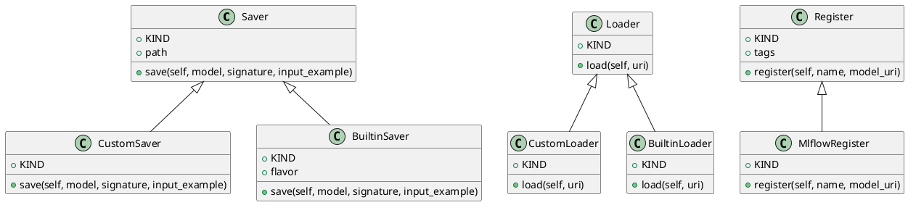

<!-- AUTOGENERATED_START -->
# src/regression_model_template/io/registries.py

## Module Overview
Savers, loaders, and registers for model registries.

## Dependencies
- `abc`
- `typing`
- `mlflow`
- `pydantic`
- `regression_model_template.core`
- `regression_model_template.utils`

## Public API
### Function `uri_for_model_alias`
Create a model URI from a model name and an alias.

Args:
    name (str): name of the mlflow registered model.
    alias (str): alias of the registered model.

Returns:
    str: model URI as "models:/name@alias".
- **Arguments:** name, alias
- **Returns:** str

### Function `uri_for_model_version`
Create a model URI from a model name and a version.

Args:
    name (str): name of the mlflow registered model.
    version (int): version of the registered model.

Returns:
    str: model URI as "models:/name/version."
- **Arguments:** name, version
- **Returns:** str

### Function `uri_for_model_alias_or_version`
Create a model URi from a model name and an alias or version.

Args:
    name (str): name of the mlflow registered model.
    alias_or_version (str | int): alias or version of the registered model.

Returns:
    str: model URI as "models:/name@alias" or "models:/name/version" based on input.
- **Arguments:** name, alias_or_version
- **Returns:** str

## Classes
### Class `Saver`
Base class for saving models in registry.

Separate model definition from serialization.
e.g., to switch between serialization flavors.

Parameters:
    path (str): model path inside the Mlflow store.
- **Bases:** None

#### Attributes
- `KIND`
- `path`

#### Methods
##### `save`
Save a model in the model registry.

Args:
    model (models.Model): project model to save.
    signature (signers.Signature): model signature.
    input_example (schemas.Inputs): sample of inputs.

Returns:
    Info: model saving information.
- **Arguments:** self, model, signature, input_example
- **Returns:** Info

### Class `CustomSaver`
Saver for project models using the Mlflow PyFunc module.

https://mlflow.org/docs/latest/python_api/mlflow.pyfunc.html
- **Bases:** Saver

#### Attributes
- `KIND`

#### Methods
##### `save`
- **Arguments:** self, model, signature, input_example
- **Returns:** Info

### Class `BuiltinSaver`
Saver for built-in models using an Mlflow flavor module.

https://mlflow.org/docs/latest/models.html#built-in-model-flavors

Parameters:
    flavor (str): Mlflow flavor module to use for the serialization.
- **Bases:** Saver

#### Attributes
- `KIND`
- `flavor`

#### Methods
##### `save`
- **Arguments:** self, model, signature, input_example
- **Returns:** Info

### Class `Loader`
Base class for loading models from registry.

Separate model definition from deserialization.
e.g., to switch between deserialization flavors.
- **Bases:** None

#### Attributes
- `KIND`

#### Methods
##### `load`
Load a model from the model registry.

Args:
    uri (str): URI of a model to load.

Returns:
    Loader.Adapter: model loaded.
- **Arguments:** self, uri
- **Returns:** 'Loader.Adapter'

### Class `CustomLoader`
Loader for custom models using the Mlflow PyFunc module.

https://mlflow.org/docs/latest/python_api/mlflow.pyfunc.html
- **Bases:** Loader

#### Attributes
- `KIND`

#### Methods
##### `load`
- **Arguments:** self, uri
- **Returns:** 'CustomLoader.Adapter'

### Class `BuiltinLoader`
Loader for built-in models using the Mlflow PyFunc module.

Note: use Mlflow PyFunc instead of flavors to use standard API.

https://mlflow.org/docs/latest/models.html#built-in-model-flavors
- **Bases:** Loader

#### Attributes
- `KIND`

#### Methods
##### `load`
- **Arguments:** self, uri
- **Returns:** 'BuiltinLoader.Adapter'

### Class `Register`
Base class for registring models to a location.

Separate model definition from its registration.
e.g., to change the model registry backend.

Parameters:
    tags (dict[str, T.Any]): tags for the model.
- **Bases:** None

#### Attributes
- `KIND`
- `tags`

#### Methods
##### `register`
Register a model given its name and URI.

Args:
    name (str): name of the model to register.
    model_uri (str): URI of a model to register.

Returns:
    Version: information about the registered model.
- **Arguments:** self, name, model_uri
- **Returns:** Version

### Class `MlflowRegister`
Register for models in the Mlflow Model Registry.

https://mlflow.org/docs/latest/model-registry.html
- **Bases:** Register

#### Attributes
- `KIND`

#### Methods
##### `register`
- **Arguments:** self, name, model_uri
- **Returns:** Version

## UML

<!-- AUTOGENERATED_END -->
