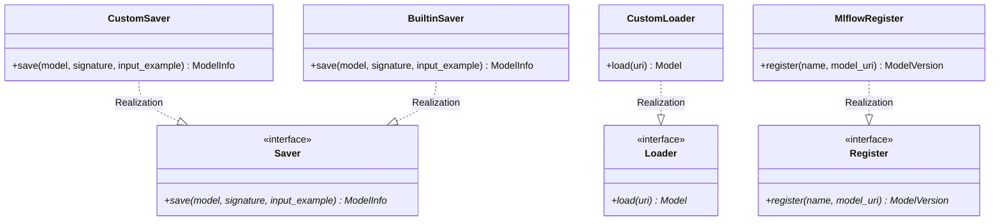

# Module Specification: MLflow Model Registries & Adapters

* **Source File Reference:** `[[src/regression_model_template/io/registries.py](../../../../src/regression_model_template/io/registries.py)](../../../../[src/regression_model_template/io/registries.py](../../../../src/regression_model_template/io/registries.py))` (Lines: L1-L317)
* **Upstream Dependencies:** `mlflow`, `pandas`
* **Downstream Consumers:** [Modules/RegressionModelTemplate/Jobs/Training](../jobs/training.md), [Modules/RegressionModelTemplate/Jobs/Promotion](../jobs/promotion.md), [Modules/RegressionModelTemplate/Jobs/Inference](../jobs/inference.md)

## 1. Architectural Role & Responsibilities
`registries.py` encapsulates MLflow Model Registry interactions. Provides abstract `Saver`, `Loader`, and `Register` interfaces, implementing `CustomSaver`, `BuiltinSaver`, `CustomLoader`, `BuiltinLoader`, `MlflowRegister`, and MLflow Python Model `Adapter` classes.

## 2. UML 2.0 Class Diagram

## 3. Class & Method Specifications

### `Saver` (`[[src/regression_model_template/io/registries.py:L69-L94](../../../../src/regression_model_template/io/registries.py#L69-L94)](../../../../[src/regression_model_template/io/registries.py](../../../../src/regression_model_template/io/registries.py)#L69-L94)`)
* `save(self, model, signature, input_example) -> ModelInfo` (L84-L94): Logs model artifact to MLflow.

### `Loader` (`[[src/regression_model_template/io/registries.py:L179-L211](../../../../src/regression_model_template/io/registries.py#L179-L211)](../../../../[src/regression_model_template/io/registries.py](../../../../src/regression_model_template/io/registries.py)#L179-L211)`)
* `load(self, uri: str)` (L203-L211): Loads registered model from MLflow URI (`models:/name/stage`).

### `MlflowRegister` (`[[src/regression_model_template/io/registries.py:L308-L317](../../../../src/regression_model_template/io/registries.py#L308-L317)](../../../../[src/regression_model_template/io/registries.py](../../../../src/regression_model_template/io/registries.py)#L308-L317)`)
* `register(self, name: str, model_uri: str)` (L316-L317): Registers model URI in MLflow Model Registry catalog.
