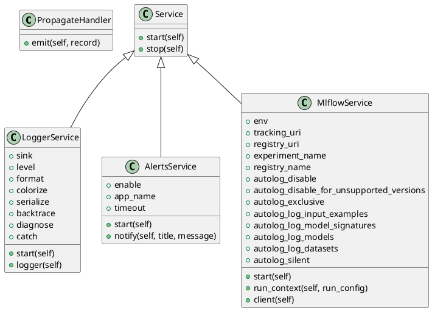

<!-- AUTOGENERATED_START -->
# src/regression_model_template/io/services.py

## Module Overview
Manage global context during execution.

## Dependencies
- `__future__`
- `abc`
- `contextlib`
- `logging`
- `sys`
- `typing`
- `typing`
- `loguru`
- `mlflow`
- `mlflow.tracking`
- `pydantic`
- `opentelemetry`
- `opentelemetry._logs`
- `opentelemetry.exporter.otlp.proto.http._log_exporter`
- `opentelemetry.exporter.otlp.proto.http.trace_exporter`
- `opentelemetry.sdk._logs`
- `opentelemetry.sdk._logs.export`
- `opentelemetry.sdk.resources`
- `opentelemetry.sdk.trace`
- `opentelemetry.sdk.trace.export`
- `plyer`
- `regression_model_template.io.osvariables`

## Public API
## Classes
### Class `PropagateHandler`
- **Bases:** None

#### Attributes
None

#### Methods
##### `emit`
- **Arguments:** self, record
- **Returns:** None

### Class `Service`
Base class for a global service.

Use services to manage global contexts.
e.g., logger object, mlflow client, spark context, ...
- **Bases:** None

#### Attributes
None

#### Methods
##### `start`
Start the service.
- **Arguments:** self
- **Returns:** None

##### `stop`
Stop the service.
- **Arguments:** self
- **Returns:** None

### Class `LoggerService`
Service for logging messages.

https://loguru.readthedocs.io/en/stable/api/logger.html

Parameters:
    sink (str): logging output.
    level (str): logging level.
    format (str): logging format.
    colorize (bool): colorize output.
    serialize (bool): convert to JSON.
    backtrace (bool): enable exception trace.
    diagnose (bool): enable variable display.
    catch (bool): catch errors during log handling.
- **Bases:** Service

#### Attributes
- `sink`
- `level`
- `format`
- `colorize`
- `serialize`
- `backtrace`
- `diagnose`
- `catch`

#### Methods
##### `start`
- **Arguments:** self
- **Returns:** None

##### `logger`
Return the main logger.

Returns:
    loguru.Logger: the main logger.
- **Arguments:** self
- **Returns:** loguru.Logger

### Class `AlertsService`
Service for sending notifications.

Require libnotify-bin on Linux systems.

In production, use with Slack, Discord, or emails.

https://plyer.readthedocs.io/en/latest/api.html#plyer.facades.Notification

Parameters:
    enable (bool): use notifications or print.
    app_name (str): name of the application.
    timeout (int | None): timeout in secs.
- **Bases:** Service

#### Attributes
- `enable`
- `app_name`
- `timeout`

#### Methods
##### `start`
- **Arguments:** self
- **Returns:** None

##### `notify`
Send a notification to the system.

Args:
    title (str): title of the notification.
    message (str): message of the notification.
- **Arguments:** self, title, message
- **Returns:** None

### Class `MlflowService`
Service for Mlflow tracking and registry.

Parameters:
    tracking_uri (str): the URI for the Mlflow tracking server.
    registry_uri (str): the URI for the Mlflow model registry.
    experiment_name (str): the name of tracking experiment.
    registry_name (str): the name of model registry.
    autolog_disable (bool): disable autologging.
    autolog_disable_for_unsupported_versions (bool): disable autologging for unsupported versions.
    autolog_exclusive (bool): If True, enables exclusive autologging.
    autolog_log_input_examples (bool): If True, logs input examples during autologging.
    autolog_log_model_signatures (bool): If True, logs model signatures during autologging.
    autolog_log_models (bool): If True, enables logging of models during autologging.
    autolog_log_datasets (bool): If True, logs datasets used during autologging.
    autolog_silent (bool): If True, suppresses all Mlflow warnings during autologging.
- **Bases:** Service

#### Attributes
- `env`
- `tracking_uri`
- `registry_uri`
- `experiment_name`
- `registry_name`
- `autolog_disable`
- `autolog_disable_for_unsupported_versions`
- `autolog_exclusive`
- `autolog_log_input_examples`
- `autolog_log_model_signatures`
- `autolog_log_models`
- `autolog_log_datasets`
- `autolog_silent`

#### Methods
##### `start`
- **Arguments:** self
- **Returns:** None

##### `run_context`
Yield an active Mlflow run and exit it afterwards.

Args:
    run (str): run parameters.

Yields:
    T.Generator[mlflow.ActiveRun, None, None]: active run context. Will be closed as the end of context.
- **Arguments:** self, run_config
- **Returns:** T.Generator[mlflow.ActiveRun, None, None]

##### `client`
Return a new Mlflow client.

Returns:
    MlflowClient: the mlflow client.
- **Arguments:** self
- **Returns:** mt.MlflowClient

## UML

<!-- AUTOGENERATED_END -->
