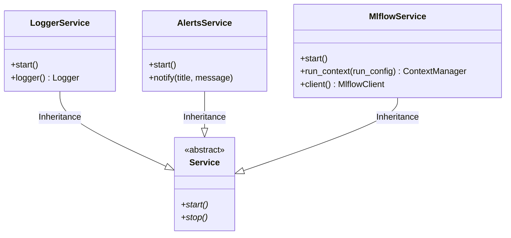

# Module Specification: Logging, Telemetry & MLflow Services

* **Source File Reference:** `src/regression_model_template/io/services.py` (Lines: L1-L252)
* **Upstream Dependencies:** `loguru`, `plyer`, `mlflow`, `opentelemetry`
* **Downstream Consumers:** [[Modules/RegressionModelTemplate/Jobs/Base]], [[Modules/RegressionModelTemplate/Jobs/Training]]

## 1. Architectural Role & Responsibilities
`services.py` provides infrastructure services (`Service` base class). Implements `LoggerService` (Loguru structured logging), `AlertsService` (desktop notifications via Plyer), and `MlflowService` (MLflow tracking client and experiment run context manager).

## 2. UML 2.0 Class Diagram

## 3. Class & Method Specifications

### `Service` (`src/regression_model_template/io/services.py:L38-L50`)
* `start(self)` (L46-L47): Abstract service initialization.
* `stop(self)` (L49-L50): Abstract service termination.

### `LoggerService` (`src/regression_model_template/io/services.py:L54-L124`)
* `start(self)` (L84-L116): Configures Loguru sinks, formatting, log retention, and OpenTelemetry OTLP log record propagation.

### `MlflowService` (`src/regression_model_template/io/services.py:L162-L252`)
* `run_context(self, run_config: RunConfig)` (L229-L244): Returns python context manager (`with mlflow_service.run_context(...)`) managing active MLflow run lifecycle.
