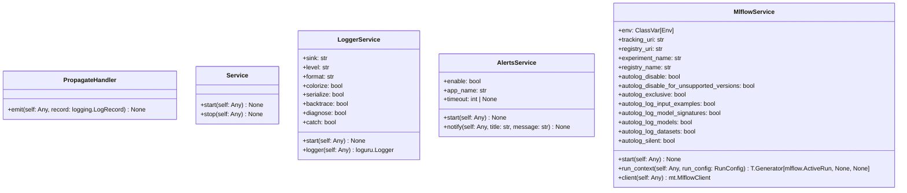

# Module Specification: services

* **Source Reference:** [src/regression_model_template/io/services.py](../../../src/regression_model_template/io/services.py) (Lines: L1-L252)

## 1. Architectural Role & Responsibilities
Manage global context during execution.

## 2. UML 2.0 Class Diagram

## 3. Class & Method Specifications

### `PropagateHandler` ([`src/regression_model_template/io/services.py:L33-L35`](../../../src/regression_model_template/io/services.py#L33-L35))

No description available.

#### Methods

* **`emit(self: Any, record: logging.LogRecord) -> None`** (L34-L35)
  - **Purpose**: No description available.
  - **Inputs**:
    - `self` (`Any`): Parameter description.
    - `record` (`logging.LogRecord`): Parameter description.
  - **Outputs**:
    - `None`: Return value description.

### `Service` ([`src/regression_model_template/io/services.py:L38-L50`](../../../src/regression_model_template/io/services.py#L38-L50))

Base class for a global service.

Use services to manage global contexts.
e.g., logger object, mlflow client, spark context, ...

#### Methods

* **`start(self: Any) -> None`** (L46-L47)
  - **Purpose**: Start the service.
  - **Inputs**:
    - `self` (`Any`): Parameter description.
  - **Outputs**:
    - `None`: Return value description.

* **`stop(self: Any) -> None`** (L49-L50)
  - **Purpose**: Stop the service.
  - **Inputs**:
    - `self` (`Any`): Parameter description.
  - **Outputs**:
    - `None`: Return value description.

### `LoggerService` ([`src/regression_model_template/io/services.py:L54-L124`](../../../src/regression_model_template/io/services.py#L54-L124))

Service for logging messages.

https://loguru.readthedocs.io/en/stable/api/logger.html

Parameters:
    sink (str): logging output.
    level (str): logging level.
    format (str): logging format.
    colorize (bool): colorize output.
    serialize (bool): convert to JSON.
    backtrace (bool): enable exception trace.
    diagnose (bool): enable variable display.
    catch (bool): catch errors during log handling.

#### Methods

* **`start(self: Any) -> None`** (L84-L116)
  - **Purpose**: No description available.
  - **Inputs**:
    - `self` (`Any`): Parameter description.
  - **Outputs**:
    - `None`: Return value description.

* **`logger(self: Any) -> loguru.Logger`** (L118-L124)
  - **Purpose**: Return the main logger.
  - **Inputs**:
    - `self` (`Any`): Parameter description.
  - **Outputs**:
    - `loguru.Logger`: Return value description.

### `AlertsService` ([`src/regression_model_template/io/services.py:L127-L159`](../../../src/regression_model_template/io/services.py#L127-L159))

Service for sending notifications.

Require libnotify-bin on Linux systems.

In production, use with Slack, Discord, or emails.

https://plyer.readthedocs.io/en/latest/api.html#plyer.facades.Notification

Parameters:
    enable (bool): use notifications or print.
    app_name (str): name of the application.
    timeout (int | None): timeout in secs.

#### Methods

* **`start(self: Any) -> None`** (L146-L147)
  - **Purpose**: No description available.
  - **Inputs**:
    - `self` (`Any`): Parameter description.
  - **Outputs**:
    - `None`: Return value description.

* **`notify(self: Any, title: str, message: str) -> None`** (L149-L159)
  - **Purpose**: Send a notification to the system.
  - **Inputs**:
    - `self` (`Any`): Parameter description.
    - `title` (`str`): Parameter description.
    - `message` (`str`): Parameter description.
  - **Outputs**:
    - `None`: Return value description.

### `MlflowService` ([`src/regression_model_template/io/services.py:L162-L252`](../../../src/regression_model_template/io/services.py#L162-L252))

Service for Mlflow tracking and registry.

Parameters:
    tracking_uri (str): the URI for the Mlflow tracking server.
    registry_uri (str): the URI for the Mlflow model registry.
    experiment_name (str): the name of tracking experiment.
    registry_name (str): the name of model registry.
    autolog_disable (bool): disable autologging.
    autolog_disable_for_unsupported_versions (bool): disable autologging for unsupported versions.
    autolog_exclusive (bool): If True, enables exclusive autologging.
    autolog_log_input_examples (bool): If True, logs input examples during autologging.
    autolog_log_model_signatures (bool): If True, logs model signatures during autologging.
    autolog_log_models (bool): If True, enables logging of models during autologging.
    autolog_log_datasets (bool): If True, logs datasets used during autologging.
    autolog_silent (bool): If True, suppresses all Mlflow warnings during autologging.

#### Methods

* **`start(self: Any) -> None`** (L211-L226)
  - **Purpose**: No description available.
  - **Inputs**:
    - `self` (`Any`): Parameter description.
  - **Outputs**:
    - `None`: Return value description.

* **`run_context(self: Any, run_config: RunConfig) -> T.Generator[mlflow.ActiveRun, None, None]`** (L229-L244)
  - **Purpose**: Yield an active Mlflow run and exit it afterwards.
  - **Inputs**:
    - `self` (`Any`): Parameter description.
    - `run_config` (`RunConfig`): Parameter description.
  - **Outputs**:
    - `T.Generator[mlflow.ActiveRun, None, None]`: Return value description.

* **`client(self: Any) -> mt.MlflowClient`** (L246-L252)
  - **Purpose**: Return a new Mlflow client.
  - **Inputs**:
    - `self` (`Any`): Parameter description.
  - **Outputs**:
    - `mt.MlflowClient`: Return value description.
