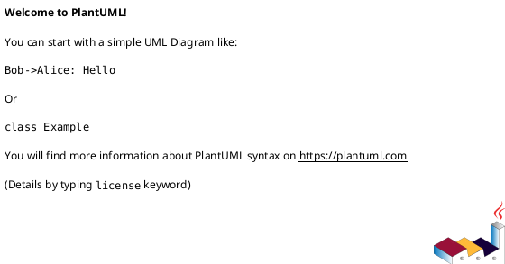

<!-- AUTOGENERATED_START -->
# src/regression_model_template/jobs/__init__.py

## Module Overview
High-level jobs of the project.

## Dependencies
- `regression_model_template.jobs.evaluations`
- `regression_model_template.jobs.explanations`
- `regression_model_template.jobs.inference`
- `regression_model_template.jobs.promotion`
- `regression_model_template.jobs.training`
- `regression_model_template.jobs.tuning`

## Public API
## Classes
## UML

<!-- AUTOGENERATED_END -->
