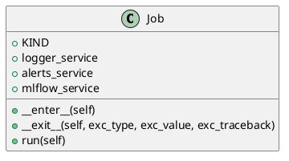

<!-- AUTOGENERATED_START -->
# src/regression_model_template/jobs/base.py

## Module Overview
Base for high-level project jobs.

## Dependencies
- `abc`
- `types`
- `typing`
- `pydantic`
- `regression_model_template.io`

## Public API
## Classes
### Class `Job`
Base class for a job.

use a job to execute runs in  context.
e.g., to define common services like logger

Parameters:
    logger_service (services.LoggerService): manage the logger system.
    alerts_service (services.AlertsService): manage the alerts system.
    mlflow_service (services.MlflowService): manage the mlflow system.
- **Bases:** None

#### Attributes
- `KIND`
- `logger_service`
- `alerts_service`
- `mlflow_service`

#### Methods
##### `__enter__`
Enter the job context.

Returns:
    T.Self: return the current object.
- **Arguments:** self
- **Returns:** T.Self

##### `__exit__`
Exit the job context.

Args:
    exc_type (T.Type[BaseException] | None): ignored.
    exc_value (BaseException | None): ignored.
    exc_traceback (TS.TracebackType | None): ignored.

Returns:
    T.Literal[False]: always propagate exceptions.
- **Arguments:** self, exc_type, exc_value, exc_traceback
- **Returns:** T.Literal[False]

##### `run`
Run the job in context.

Returns:
    Locals: local job variables.
- **Arguments:** self
- **Returns:** Locals

## UML

<!-- AUTOGENERATED_END -->
