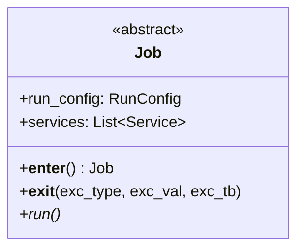

# Module Specification: Base Pipeline Job

* **Source File Reference:** `[[src/regression_model_template/jobs/base.py](../../../../src/regression_model_template/jobs/base.py)](../../../../[src/regression_model_template/jobs/base.py](../../../../src/regression_model_template/jobs/base.py))` (Lines: L21-L85)
* **Upstream Dependencies:** [Modules/RegressionModelTemplate/IO/Services](../io/services.md)
* **Downstream Consumers:** All concrete jobs in `jobs/*.py`

## 1. Architectural Role & Responsibilities
`base.py` defines abstract base class `Job`. Manages resource acquisition and cleanup (`__enter__`, `__exit__`), initializes logging, telemetry, and MLflow services, and enforces execution contracts via `run()`.

## 2. UML 2.0 Class Diagram

## 3. Class & Method Specifications

### `Job` (`[[src/regression_model_template/jobs/base.py:L21-L85](../../../../src/regression_model_template/jobs/base.py#L21-L85)](../../../../[src/regression_model_template/jobs/base.py](../../../../src/regression_model_template/jobs/base.py)#L21-L85)`)
* `__enter__(self) -> Job` (L39-L52): Starts all registered services (`LoggerService`, `MlflowService`) upon entering `with` context block.
* `__exit__(self, exc_type, exc_value, exc_traceback)` (L54-L77): Stops all services, logs uncaught exceptions, and triggers failure alerts if necessary.
* `run(self)` (L80-L85): Abstract workflow execution method.
