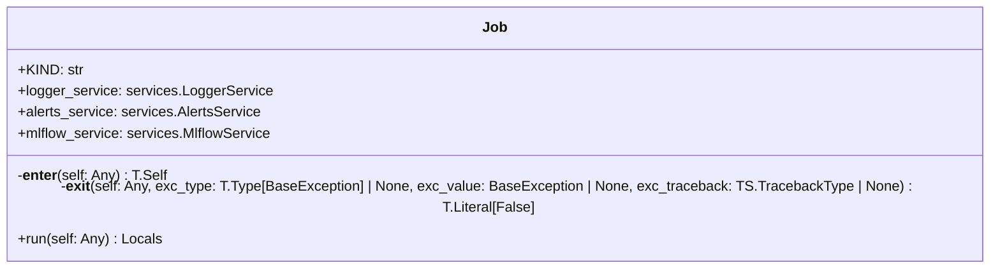

# Module Specification: base

* **Source Reference:** [src/regression_model_template/jobs/base.py](../../../src/regression_model_template/jobs/base.py) (Lines: L1-L85)

## 1. Architectural Role & Responsibilities
Base for high-level project jobs.

## 2. UML 2.0 Class Diagram

## 3. Class & Method Specifications

### `Job` ([`src/regression_model_template/jobs/base.py:L21-L85`](../../../src/regression_model_template/jobs/base.py#L21-L85))

Base class for a job.

use a job to execute runs in  context.
e.g., to define common services like logger

Parameters:
    logger_service (services.LoggerService): manage the logger system.
    alerts_service (services.AlertsService): manage the alerts system.
    mlflow_service (services.MlflowService): manage the mlflow system.

#### Methods

* **`__enter__(self: Any) -> T.Self`** (L39-L52)
  - **Purpose**: Enter the job context.
  - **Inputs**:
    - `self` (`Any`): Parameter description.
  - **Outputs**:
    - `T.Self`: Return value description.

* **`__exit__(self: Any, exc_type: T.Type[BaseException] | None, exc_value: BaseException | None, exc_traceback: TS.TracebackType | None) -> T.Literal[False]`** (L54-L77)
  - **Purpose**: Exit the job context.
  - **Inputs**:
    - `self` (`Any`): Parameter description.
    - `exc_type` (`T.Type[BaseException] | None`): Parameter description.
    - `exc_value` (`BaseException | None`): Parameter description.
    - `exc_traceback` (`TS.TracebackType | None`): Parameter description.
  - **Outputs**:
    - `T.Literal[False]`: Return value description.

* **`run(self: Any) -> Locals`** (L80-L85)
  - **Purpose**: Run the job in context.
  - **Inputs**:
    - `self` (`Any`): Parameter description.
  - **Outputs**:
    - `Locals`: Return value description.
