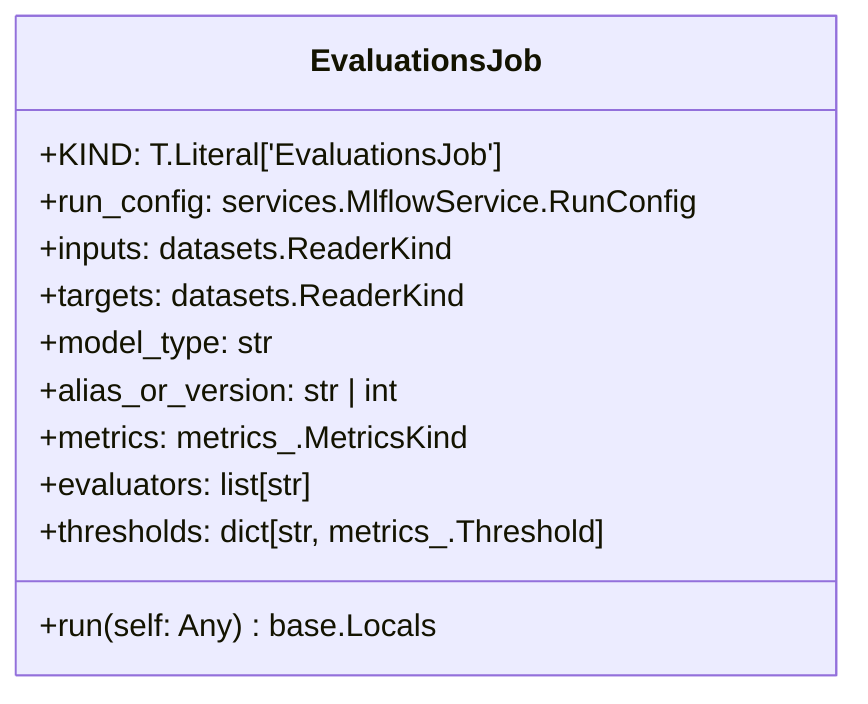
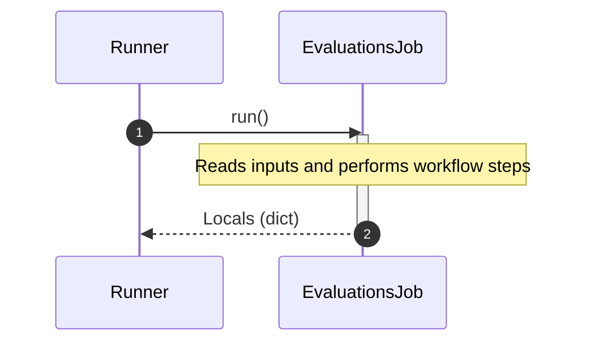

# Module Specification: evaluations

* **Source Reference:** [src/regression_model_template/jobs/evaluations.py](../../../src/regression_model_template/jobs/evaluations.py) (Lines: L1-L125)

## 1. Architectural Role & Responsibilities
Define a job for evaluating registered models with data.

## 2. UML 2.0 Class Diagram

## 2b. Execution Flow (Sequence Diagram)

## 3. Class & Method Specifications

### `EvaluationsJob` ([`src/regression_model_template/jobs/evaluations.py:L19-L125`](../../../src/regression_model_template/jobs/evaluations.py#L19-L125))

Generate evaluations from a registered model and a dataset.

Parameters:
    run_config (services.MlflowService.RunConfig): mlflow run config.
    inputs (datasets.ReaderKind): reader for the inputs data.
    targets (datasets.ReaderKind): reader for the targets data.
    model_type (str): model type (e.g. "regressor", "classifier").
    alias_or_version (str | int): alias or version for the  model.
    metrics (metrics_.MetricKind): metrics for the reporting.
    evaluators (list[str]): list of evaluators to use.
    thresholds (dict[str, metrics_.Threshold] | None): metric thresholds.

#### Methods

* **`run(self: Any) -> base.Locals`** (L50-L125)
  - **Purpose**: No description available.
  - **Inputs**:
    - `self` (`Any`): Parameter description.
  - **Outputs**:
    - `base.Locals`: Return value description.
