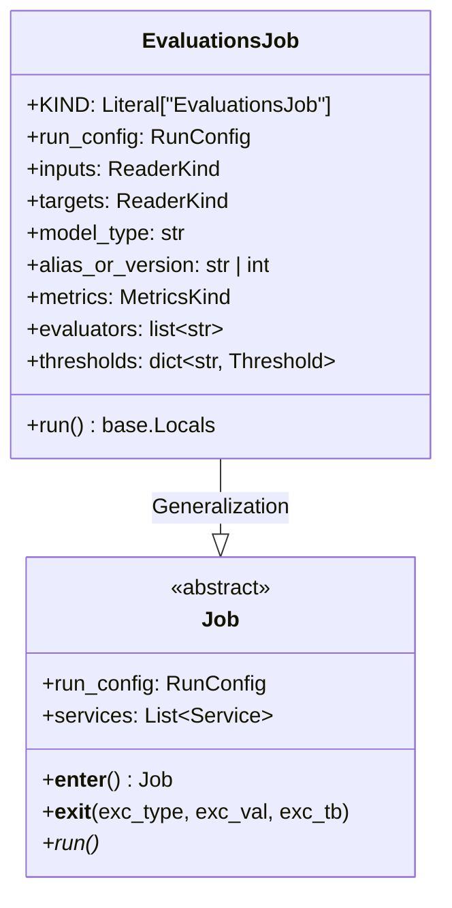
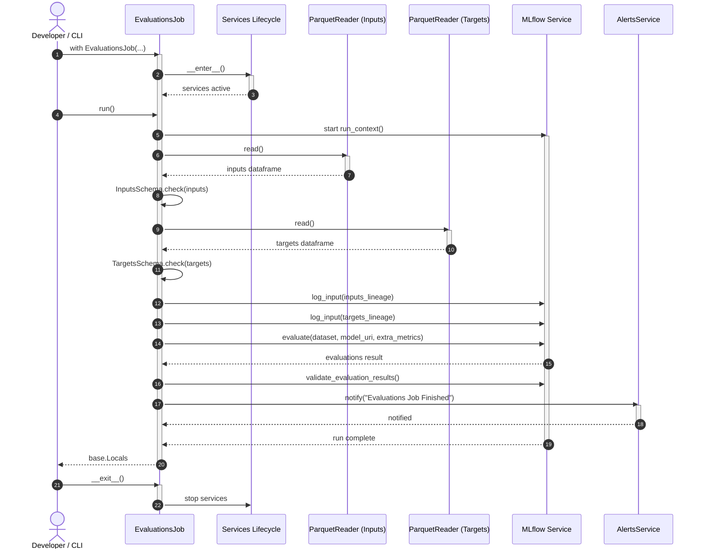

# Module Specification: Model Evaluation Job

* **Source File Reference:** [`src/regression_model_template/jobs/evaluations.py`](/src/regression_model_template/jobs/evaluations.py) (Lines: L19-L125)
* **Upstream Dependencies:** [Modules/RegressionModelTemplate/Jobs/Base](base.md), [Modules/RegressionModelTemplate/Core/Metrics](../core/metrics.md), [Modules/RegressionModelTemplate/IO/Registries](../io/registries.md)
* **Downstream Consumers:** [Modules/RegressionModelTemplate/Scripts](../scripts.md)

## 1. Architectural Role & Responsibilities

`EvaluationsJob` implements model validation workflows. It loads model candidates from the MLflow model registry, executes evaluation suites against unseen datasets, enforces quality gate thresholds, and raises alerts on failures.

## 2. UML 2.0 Class Diagram

## 3. Execution Workflow Sequence Diagram

## 4. Class & Method Specifications

### `EvaluationsJob` ([`src/regression_model_template/jobs/evaluations.py:L19-L125`](/src/regression_model_template/jobs/evaluations.py#L19-L125))

#### `run(self) -> base.Locals`
* **Visibility:** Public (`+`)
* **Polymorphism:** Overrides the abstract `run()` method defined in `Job` (polymorphic implementation).
* **Behavior:** Enforces the model evaluation and validation pipeline. Reads dataset inputs/targets, performs validation against schemas, queries candidate models, computes metrics via MLflow, validates metrics against threshold targets, and sends notifications.

##### Input Parameters (Instantiated via Constructor):
| Parameter | Data Type | Required / Default | Semantic Description |
| :--- | :--- | :--- | :--- |
| `run_config` | `services.MlflowService.RunConfig` | Default (`RunConfig(name="Evaluations")`) | Configures MLflow tracking run parameters. |
| `inputs` | `datasets.ReaderKind` | **Required** | Reader configuration for inputs data. |
| `targets` | `datasets.ReaderKind` | **Required** | Reader configuration for targets data. |
| `model_type` | `str` | Default (`"regressor"`) | Targeted ML workload category (e.g. regressor, classifier). |
| `alias_or_version` | `str \| int` | Default (`"Champion"`) | Target model alias or version in MLflow registry. |
| `metrics` | `metrics_.MetricsKind` | Default (`[SklearnMetric()]`) | Metric evaluation suite. |
| `evaluators` | `list[str]` | Default (`["default"]`) | Evaluator engines to execute. |
| `thresholds` | `dict[str, metrics_.Threshold]` | Default (`{"r2_score": Threshold(0.5)}`) | Minimum metric validation thresholds. |

##### Return Value & Output Shape:
| Return Type | Scenario | Description |
| :--- | :--- | :--- |
| `base.Locals` | Success | Dict containing local execution variables (dataframes, metrics, and run properties). |

##### Thrown Exceptions & Error States:
* `ValueError`: Raised if metric thresholds are violated.
* `ValidationError`: Raised if dataset inputs/targets violate schema requirements.
