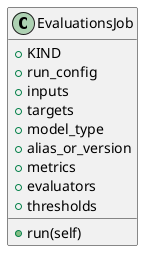

<!-- AUTOGENERATED_START -->
# src/regression_model_template/jobs/evaluations.py

## Module Overview
Define a job for evaluating registered models with data.

## Dependencies
- `typing`
- `mlflow`
- `pandas`
- `pydantic`
- `regression_model_template.core`
- `regression_model_template.core`
- `regression_model_template.io`
- `regression_model_template.jobs`

## Public API
## Classes
### Class `EvaluationsJob`
Generate evaluations from a registered model and a dataset.

Parameters:
    run_config (services.MlflowService.RunConfig): mlflow run config.
    inputs (datasets.ReaderKind): reader for the inputs data.
    targets (datasets.ReaderKind): reader for the targets data.
    model_type (str): model type (e.g. "regressor", "classifier").
    alias_or_version (str | int): alias or version for the  model.
    metrics (metrics_.MetricKind): metrics for the reporting.
    evaluators (list[str]): list of evaluators to use.
    thresholds (dict[str, metrics_.Threshold] | None): metric thresholds.
- **Bases:** None

#### Attributes
- `KIND`
- `run_config`
- `inputs`
- `targets`
- `model_type`
- `alias_or_version`
- `metrics`
- `evaluators`
- `thresholds`

#### Methods
##### `run`
- **Arguments:** self
- **Returns:** base.Locals

## UML

<!-- AUTOGENERATED_END -->
